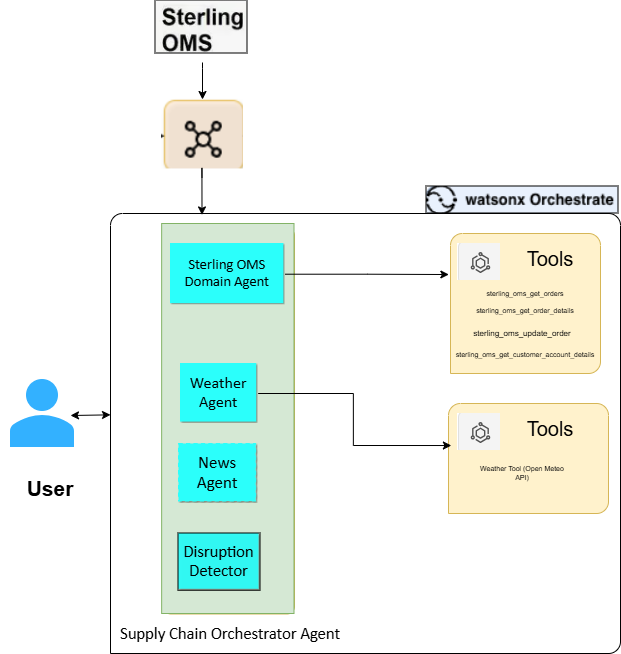

# Watsonx Orchestrate – Smart Supply Chain Agent Setup

This document describes how to import and configure the Smart Supply Chain agents and tools in a watsonx Orchestrate (WxO) environment using the Agent Development Kit (ADK).

The setup includes a customized Sterling OMS domain agent, multiple supporting agents, and a supervisory orchestration agent named Sterling OMS Smart Supply Chain Agent.

## Prerequisites

- Before starting, ensure the following:

- Access to a watsonx Orchestrate (WxO) instance

- WxO ADK CLI installed

- Logged in to WxO via CLI

- Required YAML and Python files available locally

## Architecture



## Step 1: Importing Tools and Agents

The following components will be imported:

Agents Included

1. Sterling OMS Domain Agent

2. Weather Agent

3. News Agent

4. Disruption Detector Agent

5. Sterling OMS Smart Supply Chain Agent (Supervisory Agent)

### Step 1.1: Import Weather Tool

The Weather tool is implemented as a Python-based custom tool and must be imported before the Weather Agent.

```
orchestrate tools import -k python \
  -f "tools/weather_retriever_tool/weather_tool.py" \
  -r "tools/weather_retriever_tool/requirements.txt"
```


### Step 1.2: Import Weather Agent
```
orchestrate agents import -f agents/weather_agent.yaml
```


### Step 1.3: Import News Agent
```
orchestrate agents import -f agents/news_agent.yaml
```


### Step 1.4: Import Disruption Detector Agent

The Disruption Detector Agent analyzes weather and news signals to detect potential supply chain disruptions.
```
orchestrate agents import -f agents/disruption_detector_agent.yaml
```


### Step 1.5: Import Sterling OMS Domain Agent

The Sterling OMS Domain Agent available in the WxO trial instance has been customized to retrieve additional address details.
This customized domain agent must be imported using the bash import command.

```
cd wxo-domains

bash import --manager collaborator_agents/supply_chain/sterling_order_management_agent.yaml
```


### Step 1.6: Import Sterling OMS Smart Supply Chain Agent

This agent acts as the supervisory orchestrator, coordinating all domain and supporting agents to produce a consolidated supply chain response.

```
orchestrate agents import -f agents/supply_chain_agent.yaml
```


## Step 2: Verify Imports

After importing all tools and agents, verify the setup.

```
orchestrate agents list
```

### Verification Checklist

- Weather Agent

- News Agent

- Disruption Detector Agent

- Sterling OMS Domain Agent

- Sterling OMS Smart Supply Chain Agent

## Notes

- Import tools before importing agents that depend on them

- Re-import agents after modifying YAML definitions

- Ensure you are in the correct directory when running bash import

- Agent names in YAML should match exactly with referenced agents
