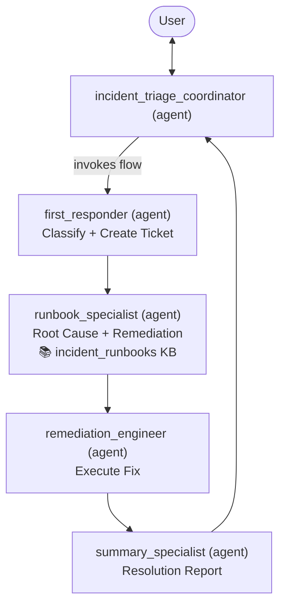

# IT ServiceOps Automation — Intelligent Incident Triage: Business Requirements Document (BRD)

| | |
|---|---|
| **Document Title** | IT ServiceOps Automation — Intelligent Incident Triage |
| **Version** | 0.5 — Demo Draft |
| **Status** | For Initial Review |
| **Prepared by** | IT Operations, Energy & Utilities Business Unit |
| **Date** | 2026 |
| **Audience** | IT Leadership, Solution Delivery Team |

---

## 1. Executive Summary

The IT Operations function currently handles a high volume of repetitive, low-complexity incidents across critical systems including SCADA, billing, and network infrastructure. First-line support teams spend a disproportionate amount of time on manual triage — classifying tickets, searching runbooks, and applying known fixes.

This document defines the requirements for an **Intelligent Incident Triage capability** that automates this process end-to-end, from ticket submission through to resolution and status update.

---

## 2. Business Problem

- L1 support agents manually review and classify every incoming incident ticket.
- Triage is inconsistent and dependent on individual experience.
- Resolution steps are scattered across runbooks, causing lookup delays.
- Simple, repeatable fixes consume significant engineer time.

**Desired outcome:** A user submits a free-text incident description and receives a structured resolution summary — ticket ID, category, severity, action taken, and status — without any manual intervention.

---

## 3. Business Objectives

1. Automate end-to-end triage for known incident types.
2. Produce consistent, structured resolution summaries for every incident.
3. Show stakeholders a seamless, working end-to-end demo using representative data.

---

## 4. Scope

### In Scope (Demo)

- A capability that accepts a free-text incident description and handles the full resolution lifecycle automatically.
- Three demonstration scenarios covering Network, Application, and Access incident types.

> **Note:** This is a proof-of-concept for initial demo and stakeholder review. All data and system responses are mocked — no production systems will be connected or affected.

### Out of Scope (Demo)

- Any live integration with production systems.
- Escalation paths or human-in-the-loop approvals.
- Audit logging infrastructure.
- End-user portal or ticketing system integration.

---

## 5. Business Requirements

| # | Requirement | Description | Owner |
|---|---|---|---|
| BR-01 | **Incident Classification** | The system must automatically classify an incident into a category (Network / Application / Access / Infrastructure) and assign a severity level (Critical / High / Medium / Low) from the user's free-text description alone. | `first_responder` |
| BR-02 | **Ticket Creation** | The system must automatically create a support ticket for every incident, capturing the issue details, affected system, user impact, category, and severity. | `first_responder` |
| BR-03 | **Runbook Lookup** | The system must automatically search available knowledge to identify the root cause, recommended resolution steps, and a suitable remediation action for the incident. | `runbook_specialist` |
| BR-04 | **Automated Remediation** | The system must automatically execute the recommended remediation action without requiring manual intervention. | `remediation_engineer` |
| BR-05 | **Resolution Summary** | The system must present the user with a clear, plain-language resolution summary including: Ticket ID, Category, Severity, Action Taken, and Status. | `summary_specialist` |
| BR-06 | **Explainability** | The system must show the user why the incident was classified as it was and what action was taken, in plain language. | `summary_specialist` |

> **Note:** BR-01 and BR-02 are both fulfilled by the `first_responder` agent in a single step — it classifies the incident and immediately creates the support ticket using the `create_support_ticket` tool.

---

## 6. Demo Scenarios

### Scenario A — Network Outage

| | |
|---|---|
| **Input** | "VPN connection failed for multiple users. Network. Remote operations team is blocked." |
| **Expected Classification** | Network / High |
| **Expected Action** | VPN gateway service restarted |
| **Expected Summary** | Ticket created, Category: Network, Severity: High, Action: VPN gateway restarted, Status: Auto-resolved |

### Scenario B — Application Unavailability

| | |
|---|---|
| **Input** | "SCADA dashboard not loading. SCADA. Control room cannot monitor grid." |
| **Expected Classification** | Application / Critical |
| **Expected Action** | SCADA web service restarted |
| **Expected Summary** | Ticket created, Category: Application, Severity: Critical, Action: SCADA service restarted, Status: Auto-resolved |

### Scenario C — Access Issue

| | |
|---|---|
| **Input** | "User cannot access billing system. Billing. Unable to process payments." |
| **Expected Classification** | Access / High |
| **Expected Action** | User account unlocked |
| **Expected Summary** | Ticket created, Category: Access, Severity: High, Action: Access reset, Status: Auto-resolved |

---

## 7. Current Operating Model & Solution Intent

Today, incident triage is handled by a small human team operating in clearly defined roles:

- A **Team Lead** receives every incoming incident, assesses its nature, and coordinates the response across the team.
- A **First Responder** assesses the incident description, determines the category and severity, and logs a support ticket.
- A **Knowledge & Runbook Specialist** consults internal documentation to identify the root cause and recommended resolution steps.
- A **Remediation Engineer** applies the fix and confirms the outcome back to the Team Lead.
- A **Summary Specialist** compiles the full resolution record and presents it to the requester.

This division of responsibility reflects hard-won operational experience — each role requires a different type of expertise, and handoffs between them are deliberate and traceable.

The intended solution should mirror this model. Rather than consolidating all logic into a single opaque system, the solution should replicate the same structure: a coordinating workflow that manages the end-to-end process, supported by specialised agents that each own a distinct step — each operating independently, with clear inputs and outputs. This approach preserves the accountability, transparency, and explainability of the current human model — while eliminating the manual effort and inconsistency that comes with it.

### Agent Roster

| Human Role | Agent | Responsibilities | Tool / KB |
|---|---|---|---|
| Team Lead | `incident_triage_coordinator` | User-facing entry and exit point; invokes the triage flow; presents the final report | `incident_triage_orchestration` (flow) |
| First Responder | `first_responder` | Classifies the incident (category, severity, affected system); creates the support ticket | `create_support_ticket` |
| Knowledge & Runbook Specialist | `runbook_specialist` | Searches the knowledge base; identifies root cause, resolution steps, and remediation action | `incident_runbooks` KB |
| Remediation Engineer | `remediation_engineer` | Executes the recommended remediation action; confirms outcome | `execute_remediation_action` |
| Summary Specialist | `summary_specialist` | Compiles all step outputs into a plain-language resolution report | — |

### Target Architecture

The target architecture is mandatory for this demo implementation:
- a single coordinating **`@flow`** in watsonx Orchestrate that owns the end-to-end sequence
- separate specialist **agents** for each role that requires independent reasoning or responsibility
- supporting **tools** for deterministic system actions, owned by the agent responsible for that action
- no single all-in-one agent implementation for the full lifecycle

The triage steps are fixed and sequential — classify, ticket, look up, remediate, summarise — and each step feeds structured data into the next. There is no branching logic or LLM-driven decision-making between steps. This makes the workflow deterministic, and the intended implementation uses a **`@flow`** in watsonx Orchestrate to connect the specialist agents in sequence — not a multi-agent conversational loop. The **`@flow`** is the coordinator: each specialist agent is a node inside the flow, called in order, with structured data passed from one to the next.

For avoidance of doubt, the expected implementation pattern is:
- user-facing entry agent receives the incident request
- that agent invokes the coordinating **`incident_triage_orchestration`** flow
- the flow calls the specialist agents in order; each agent calls its own tool where applicable
- each specialist agent owns only its designated step and does not absorb the full process

### Flow Sequence & Data Handoffs

The flow executes the following steps in strict sequential order. Each step's outputs become the inputs for subsequent steps.

| Step | Agent | Inputs | Outputs |
|---|---|---|---|
| 1 | `first_responder` | `incident_description` | `category`, `severity`, `affected_system`, `user_impact`, `ticket_id`, `ticket_url` |
| 2 | `runbook_specialist` | `incident_description`, `category`, `severity` | `root_cause`, `resolution_steps[]`, `remediation_action` |
| 3 | `remediation_engineer` | `remediation_action` | `confirmation` |
| 4 | `summary_specialist` | `ticket_id`, `ticket_url`, `category`, `severity`, `remediation_action`, `confirmation` | Final plain-language resolution summary |

---

## 8. Assumptions

| | |
|---|---|
| **Assumption** | Knowledge base content is pre-loaded with resolution data for the three demo scenarios. |
| **Assumption** | Remediation actions return a fixed confirmation — no real system calls are made for this demo. |
| **Assumption** | Ticket creation generates a mock ticket ID and URL — no real ticketing system is connected. |
| **Assumption** | All three demo scenarios represent the full test coverage for this review. |

---

## 9. Acceptance Criteria

- [ ] User submits a free-text incident description and receives a resolution summary with no manual steps.
- [ ] All three demo scenarios produce the expected classification, action, and summary as defined in Section 6.
- [ ] The system provides a plain-language explanation of its classification and the action taken.