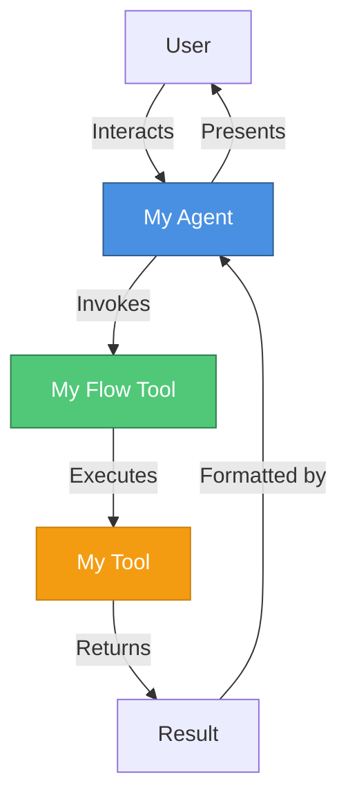
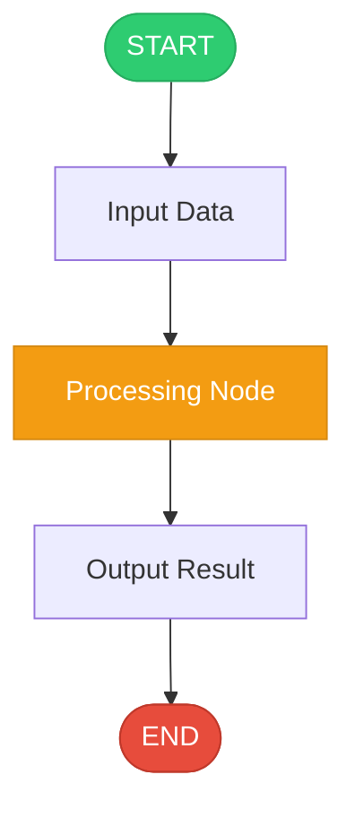
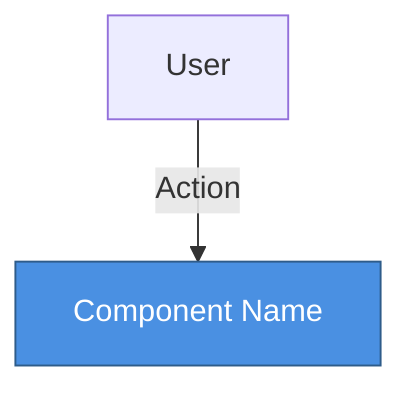
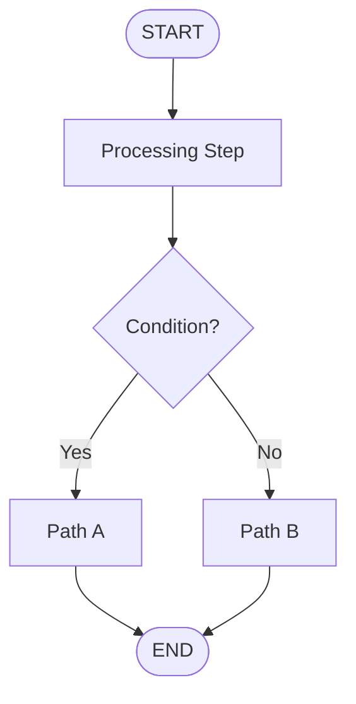

# watsonx Orchestrate (WxO) Implementation Guide

## Table of Contents
1. [Overview](#overview)
2. [Navigating the ADK](#navigating-the-adk)
3. [Core Concepts](#core-concepts)
4. [Example Categories](#example-categories)
5. [Standard Project Structure](#standard-project-structure)
6. [Implementation Patterns](#implementation-patterns)
7. [Quick Start Guide](#quick-start-guide)

---

## Overview

This guide helps you navigate the **IBM watsonx Orchestrate Agent Development Kit (ADK)** examples and use them as a basis for implementing new watsonx Orchestrate agents and tools projects.

**ADK Repository**: https://github.com/IBM/ibm-watsonx-orchestrate-adk

The ADK provides:
- **Python SDK** for programmatic agent development
- **CLI tool** (`orchestrate` command) for managing agents, tools, and environments
- **Developer Edition** - a local, self-contained instance of watsonx Orchestrate
- **Production Integration** - ability to deploy to production watsonx Orchestrate instances

---

## Navigating the ADK

### Key Directories

```
watsonx Orchestrate ADK/
├── examples/                         # Example implementations (START HERE)
│   ├── agent_builder/                # Agent examples
│   ├── flow_builder/                 # Flow examples
│   ├── channel-integrations/         # Channel integration examples
│   └── plugins/                      # Plugin examples
├── src/ibm_watsonx_orchestrate/     # SDK source (for reference)
│   ├── agent_builder/                # Agent creation APIs
│   ├── flow_builder/                 # Flow/workflow APIs
│   └── cli/                          # CLI commands
└── packages/                         # Additional packages
```

### How to Use This Guide

1. **Browse Example Categories** - Find examples similar to your use case
2. **Study Standard Structure** - Understand the consistent project layout
3. **Follow Implementation Patterns** - Use proven patterns for common scenarios
4. **Use Quick Start Guide** - Create new projects based on examples

---

## Core Concepts

### 1. **Agents**
AI assistants that can use tools and interact with users. Defined using YAML configuration:

```yaml
spec_version: v1
kind: native
name: my_agent
description: Agent description
instructions: Detailed instructions for the agent
llm: groq/openai/gpt-oss-120b
style: default
tools:
  - tool_name_1
  - tool_name_2
```

### 2. **Tools**
Functions that agents can invoke. Three main types:

- **Python Tools**: Python functions decorated with `@tool`
- **Flow Tools**: Workflows built with the flow builder
- **OpenAPI Tools**: REST APIs defined by OpenAPI specs

### 3. **Flows**
Workflows that orchestrate multiple steps, tools, and logic:

```python
from ibm_watsonx_orchestrate.flow_builder.flows import Flow, flow, START, END

@flow(
    name="my_flow",
    display_name="My Flow",
    description="Flow description",
    input_schema=MyInputSchema
)
def build_my_flow(aflow: Flow) -> Flow:
    # Define flow nodes and sequence
    node1 = aflow.tool(my_tool_function)
    node2 = aflow.llm(prompt="Process this: {input}")
    
    aflow.sequence(START, node1, node2, END)
    return aflow
```

### 4. **Connections**
Authenticated connections to external services (ServiceNow, Salesforce, etc.)

### 5. **Knowledge Bases**
Document repositories that agents can search through for information

---

## Example Categories

### 1. **Agent Builder Examples** (`examples/agent_builder/`)

#### Customer Care (`customer_care/`)
- **Purpose**: Healthcare customer service agent
- **Features**: ServiceNow integration, benefits queries, doctor search
- **Key Components**:
  - Agent YAML configuration
  - Python tools for API integration
  - Connection setup for ServiceNow

#### Voice-Enabled Agents
- `voice_enabled_deepgram/` - Deepgram voice integration
- `voice_enabled_elevenlabs/` - ElevenLabs voice integration
- `voice_enabled_watson/` - Watson voice integration

### 2. **Flow Builder Examples** (`examples/flow_builder/`)

#### Simple Flows

**hello_message_flow/**
- **Purpose**: Basic flow demonstrating message generation
- **Pattern**: Simple tool invocation
- **Use Case**: Learning flow basics

**get_pet_facts/**
- **Purpose**: Fetch and display pet facts
- **Pattern**: External API integration
- **Use Case**: Simple data retrieval

#### Document Processing Flows

**document_processing/**
- **Purpose**: Extract structured data from documents
- **Pattern**: Watson Document Understanding integration
- **Key Features**:
  - KVP (Key-Value Pair) schema definition
  - Document processing node (`docproc`)
  - Support for PDFs and images

**document_classifier/**
- **Purpose**: Classify documents by type
- **Pattern**: Document analysis and categorization

**document_extractor/**
- **Purpose**: General document data extraction
- **Pattern**: Flexible extraction framework

#### Workflow Patterns

**user_activity/**
- **Purpose**: Interactive user input collection
- **Pattern**: User activity nodes
- **Use Case**: Gathering structured user input

**foreach_email/**
- **Purpose**: Process multiple emails
- **Pattern**: Loop/iteration over collections
- **Use Case**: Batch processing

**get_tuition_reimbursed/**
- **Purpose**: Tuition reimbursement workflow
- **Pattern**: Multi-step approval process
- **Use Case**: Business process automation

#### Conditional Logic

**get_pet_facts_if_else/**
- **Purpose**: Conditional flow execution
- **Pattern**: If-else branching
- **Use Case**: Decision-based workflows

#### Advanced Patterns

**collaborator_agents/**
- **Purpose**: Multiple agents working together
- **Pattern**: Agent collaboration
- **Use Case**: Complex multi-agent scenarios

**triage_workflow_agent_swarm/**
- **Purpose**: Agent swarm for task distribution
- **Pattern**: Dynamic agent selection
- **Use Case**: Intelligent task routing

**agent_scheduler/**
- **Purpose**: Scheduled agent execution
- **Pattern**: Time-based triggers
- **Use Case**: Automated periodic tasks

---

## Standard Project Structure

Every example follows a consistent structure:

```
example_name/
├── __init__.py                    # Python package initialization
├── README.md                      # Documentation and usage instructions
├── main_flow.py                   # Programmatic testing script to test Flow.  Not needed if no flow is created.
├── import-all.sh                  # Import script for CLI
├── .env (optional)                # Environment variables
├── tools/                         # Tool implementations
│   ├── __init__.py
│   ├── tool_name.py              # Python tool definitions
│   └── flow_name.py              # Flow definitions
├── agents/                        # Agent configurations
│   └── agent_name.yaml           # Agent YAML files
└── generated/                     # Generated artifacts
    └── flow_spec.json            # Compiled flow specifications
```

### Key Files Explained

#### 1. **tools/[tool_name].py**
Python tools decorated with `@tool`:

```python
from ibm_watsonx_orchestrate.agent_builder.tools import tool, ToolPermission

@tool(permission=ToolPermission.READ_ONLY)
def my_tool(param: str) -> dict:
    """Tool description"""
    # Implementation
    return {"result": "value"}
```

#### 2. **tools/[flow_name].py**
Flow definitions using `@flow` decorator:

```python
from ibm_watsonx_orchestrate.flow_builder.flows import Flow, flow, START, END

@flow(
    name="my_flow",
    display_name="My Flow",
    description="Flow description",
    input_schema=InputSchema
)
def build_my_flow(aflow: Flow) -> Flow:
    # Build flow
    return aflow
```

#### 3. **agents/[agent_name].yaml**
Agent configuration:

```yaml
spec_version: v1
kind: native
name: agent_name
description: Agent description
instructions: Detailed instructions
llm: groq/openai/gpt-oss-120b
style: default
tools:
  - tool_or_flow_name
```

#### 4. **main_flow.py**
Programmatic testing:

```python
import asyncio
from pathlib import Path
from examples.example_name.tools.flow_name import build_flow

async def main():
    flow_def = await build_flow().compile_deploy()
    generated_folder = f"{Path(__file__).resolve().parent}/generated"
    flow_def.dump_spec(f"{generated_folder}/flow.json")
    await flow_def.invoke({"input": "value"}, debug=True)

if __name__ == "__main__":
    asyncio.run(main())
```

#### 5. **import-all.sh**
CLI import script:

```bash
#!/usr/bin/env bash

# orchestrate env activate local # only used if user asked to activate local env
SCRIPT_DIR=$( cd -- "$( dirname -- "${BASH_SOURCE[0]}" )" &> /dev/null && pwd )

# Import Python tools
for tool in tool1.py tool2.py; do
  orchestrate tools import -k python -f ${SCRIPT_DIR}/tools/${tool}
done

# Import Flow tools
for flow in flow1.py; do
  orchestrate tools import -k flow -f ${SCRIPT_DIR}/tools/${flow}
done

# Import agents
for agent in agent1.yaml; do
  orchestrate agents import -f ${SCRIPT_DIR}/agents/${agent}
done
```

---

## Implementation Patterns

### Pattern 1: Simple Tool Flow

**Use Case**: Basic data retrieval or processing

**Structure**:
```
example/
├── tools/
│   ├── my_tool.py          # Python tool
│   └── my_flow.py          # Flow that uses the tool
├── agents/
│   └── my_agent.yaml       # Agent configuration
└── main.py                 # Testing script
```

**Example**: `get_pet_facts/`

### Pattern 2: Document Processing Flow

**Use Case**: Extract structured data from documents

**Structure**:
```
example/
├── tools/
│   ├── get_kvp_schemas.py  # Define extraction schema
│   └── processing_flow.py  # Document processing flow
├── agents/
│   └── doc_agent.yaml      # Agent configuration
└── main.py                 # Testing script
```

**Key Components**:
1. **KVP Schema Tool**: Defines what fields to extract
2. **Document Processing Node**: Uses Watson Document Understanding
3. **Flow**: Orchestrates schema retrieval and document processing

**IMPORTANT - Document Upload Handling**:
When a flow expects a document as input (e.g., `DocProcInput`), the agent should invoke the flow tool directly without asking the user to upload the document first. The flow itself will handle the document upload prompt.

- ✅ **Correct Agent Instructions**:
  ```yaml
  instructions: |
    When the user wants to process a document, immediately invoke the
    document_processing_flow tool. The flow will prompt the user to
    upload the document.
  ```

- ❌ **Incorrect Agent Instructions**:
  ```yaml
  instructions: |
    Ask the user to upload a document first, then pass it to the
    document_processing_flow tool.
    # This will NOT work - the agent cannot pass uploaded documents to flows
  ```

**Why**: Agents cannot directly pass user-uploaded documents to flow tools. The flow's document input nodes (like `docproc`) handle the upload interaction directly with the user. The agent should simply invoke the flow tool and let the flow manage the document upload process.

**Example**: `extract_airline_invoice/`, `document_processing/`, `expense_report_agent/`

### Pattern 3: User Activity Flow

**Use Case**: Interactive multi-step workflows

**Structure**:
```
example/
├── tools/
│   └── activity_flow.py    # Flow with user activity nodes
├── agents/
│   └── activity_agent.yaml # Agent configuration
└── main.py                 # Testing script
```

**Key Features**:
- User activity nodes for input collection
- Form handling
- Multi-turn conversations

**Example**: `user_activity/`, `book_a_flight/`

### Pattern 4: Multi-Agent Collaboration

**Use Case**: Complex tasks requiring multiple specialized agents

**Structure**:
```
example/
├── tools/
│   ├── agent1_tools.py     # Tools for agent 1
│   ├── agent2_tools.py     # Tools for agent 2
│   └── orchestration_flow.py # Coordination flow
├── agents/
│   ├── agent1.yaml         # Specialized agent 1
│   ├── agent2.yaml         # Specialized agent 2
│   └── coordinator.yaml    # Coordinator agent
└── main.py                 # Testing script
```

**Example**: `collaborator_agents/`, `triage_workflow_agent_swarm/`

---

## Quick Start Guide

### Creating a New Example

#### Step 1: Create Directory Structure
```bash
mkdir -p examples/category/my_example/{tools,agents,generated}
touch examples/category/my_example/{__init__.py,main.py,README.md,import-all.sh}
touch examples/category/my_example/tools/__init__.py
```

#### Step 2: Create Python Tool (if needed)
```python
# tools/my_tool.py
from ibm_watsonx_orchestrate.agent_builder.tools import tool, ToolPermission

@tool(permission=ToolPermission.READ_ONLY)
def my_tool(input_param: str) -> dict:
    """Tool description"""
    return {"result": f"Processed: {input_param}"}
```

#### Step 3: Create Flow
```python
# tools/my_flow.py
from pydantic import BaseModel
from ibm_watsonx_orchestrate.flow_builder.flows import Flow, flow, START, END
from .my_tool import my_tool

class MyFlowInput(BaseModel):
    input_param: str

@flow(
    name="my_flow",
    display_name="My Flow",
    description="Flow description",
    input_schema=MyFlowInput
)
def build_my_flow(aflow: Flow) -> Flow:
    tool_node = aflow.tool(my_tool)
    aflow.sequence(START, tool_node, END)
    return aflow
```

#### Step 4: Create Agent Configuration
```yaml
# agents/my_agent.yaml
spec_version: v1
kind: native
name: my_agent
description: My agent description
instructions: Invoke my_flow tool and output the result
llm: groq/openai/gpt-oss-120b
style: default
tools:
  - my_flow
```

#### Step 5: Create Main Script (only needed if there are flows in the projects)
```python
# flow_main.py
import asyncio
from pathlib import Path
from examples.category.my_example.tools.my_flow import build_my_flow

async def main():
    flow_def = await build_my_flow().compile_deploy()
    generated_folder = f"{Path(__file__).resolve().parent}/generated"
    flow_def.dump_spec(f"{generated_folder}/my_flow.json")
    await flow_def.invoke({"input_param": "test"}, debug=True)

if __name__ == "__main__":
    asyncio.run(main())
```

#### Step 6: Create Import Script
```bash
# import-all.sh
#!/usr/bin/env bash

# orchestrate env activate local
SCRIPT_DIR=$( cd -- "$( dirname -- "${BASH_SOURCE[0]}" )" &> /dev/null && pwd )

for tool in my_tool.py; do
  orchestrate tools import -k python -f ${SCRIPT_DIR}/tools/${tool}
done

for flow in my_flow.py; do
  orchestrate tools import -k flow -f ${SCRIPT_DIR}/tools/${flow}
done

for agent in my_agent.yaml; do
  orchestrate agents import -f ${SCRIPT_DIR}/agents/${agent}
done
```

#### Step 7: Make Import Script Executable
```bash
chmod +x examples/category/my_example/import-all.sh
```

#### Step 8: Create README with Diagrams
```markdown
# My Example

## Overview
Brief description of what this example demonstrates.

## Architecture Diagram



## Workflow Diagram



## Usage

### Via Chat UI
1. Run `./import-all.sh`
2. Launch chat: `orchestrate chat start`
3. Select `my_agent`
4. Interact with the agent

### Programmatically
1. Set PYTHONPATH: `export PYTHONPATH=<ADK>/src:<ADK>`
2. Run: `python3 main.py`

## Features
- Feature 1
- Feature 2

## Output
Description of expected output
```

### Testing Your Example

#### Option 1: Via Chat UI
```bash
cd examples/category/my_example
./import-all.sh
orchestrate chat start
# Select your agent and interact
```

#### Option 2: Programmatically
```bash
export PYTHONPATH=/path/to/adk/src:/path/to/adk
cd examples/category/my_example
python3 main.py
```

---

## Best Practices

### 1. **Naming Conventions**
- Use snake_case for Python files and functions
- Use descriptive names that indicate purpose
- Agent names should match their YAML file names

### 2. **Documentation**
- Always include a README.md with:
  - Purpose and overview
  - **Architecture Diagram**: Mermaid diagram showing agent, flow, and tool relationships
  - **Workflow Diagram(s)**: One Mermaid diagram per agentic workflow showing the flow execution path
  - Usage instructions (both CLI and programmatic)
  - Expected inputs/outputs
  - Prerequisites or dependencies

#### Creating Effective Diagrams

**Architecture Diagram Guidelines:**
- Show the high-level system components (User → Agent → Flow → Tools/Services)
- Include external services or APIs being used
- Use consistent color coding (e.g., agents in blue, flows in green, tools in orange)
- Keep it simple and focused on the main interaction flow

**Workflow Diagram Guidelines:**
- Create one diagram per agentic workflow (flow tool)
- Show the complete flow from START to END
- Include all nodes: tool nodes, LLM nodes, decision points, user activity nodes
- Label branches clearly for conditional logic
- Use different colors for different node types
- Include key data transformations or processing steps

**Example Mermaid Syntax:**




### 3. **Error Handling**
- Include proper error handling in tools
- Provide meaningful error messages
- Use try-except blocks for external API calls

### 4. **Type Hints and Pydantic Models**
- Use Pydantic models for input/output schemas
- Include type hints in function signatures
- Document expected types in docstrings
- **IMPORTANT**: Always define Pydantic models explicitly as classes, never use dynamic type creation
  - ✅ **Correct**: Define models as proper classes
    ```python
    class MyOutputSchema(BaseModel):
        field_name: str = Field(description="Field description")
    ```
  - ❌ **Incorrect**: Do not use dynamic type creation
    ```python
    # This will cause Pydantic validation errors
    output_schema=type('MySchema', (BaseModel,), {
        'field_name': (str, Field(description="Field description"))
    })
    ```
  - All model fields must have proper type annotations
  - Dynamic type creation causes "non-annotated attribute" errors during model loading

### 5. **Testing**
- Provide both CLI and programmatic testing methods
- Include example inputs in README
- Test with various input scenarios

### 6. **Modularity**
- Keep tools focused and single-purpose
- Separate concerns (tools, flows, agents)
- Reuse common utilities

---

## Common Patterns Reference

### Document Processing Pattern
```python
# 1. Define KVP Schema
@tool(permission=ToolPermission.READ_ONLY)
def get_kvp_schemas(placeholder: str) -> list:
    return [{
        "document_type": "TypeName",
        "fields": {
            "field_name": {
                "description": "Field description",
                "example": "Example value"
            }
        }
    }]

# 2. Create Document Processing Flow
@flow(name="doc_flow", input_schema=DocumentProcessingCommonInput)
def build_doc_flow(aflow: Flow) -> Flow:
    schema_node = aflow.tool(get_kvp_schemas, output_schema=list)
    
    doc_node = aflow.docproc(
        name="extract_data",
        task="text_extraction",
        document_structure=True,
        enable_hw=True,
        output_format=DocProcOutputFormat.object  # Returns JSON object instead of file reference
    )
    doc_node.map_input(
        input_variable="kvp_schemas",
        expression="flow.schema_node.output"
    )
    
    aflow.sequence(START, schema_node, doc_node, END)
    
    # IMPORTANT: When using output_format=object, kvps is returned as a LIST, not a dictionary
    # Access KVP values using: flow['node_name'].output.kvps[0].get('field_name', 'default')
    aflow.map_output(
        output_variable="field_name",
        expression="flow['extract_data'].output.kvps[0].get('field_name', '') if flow['extract_data'].output.kvps else ''"
    )
    
    return aflow
```

**CRITICAL: Document Processing Output Format**

When using `output_format=DocProcOutputFormat.object` in docproc nodes:
- The `kvps` field is returned as a **list** (array), not a dictionary
- Each element in the list is a dictionary containing the extracted KVP fields
- To access KVP values, use: `flow['node_name'].output.kvps[0].get('field_name', 'default')`
- Always include a safety check: `if flow['node_name'].output.kvps else 'default'`

Example of correct KVP access with `output_format=object`:
```python
# ✅ Correct - accessing kvps as a list
aflow.map_output(
    output_variable="merchant_name",
    expression="flow['extract_data'].output.kvps[0].get('merchant_name', '') if flow['extract_data'].output.kvps else ''"
)

# ❌ Incorrect - treating kvps as a dictionary (will cause AttributeError)
aflow.map_output(
    output_variable="merchant_name",
    expression="flow['extract_data'].output.kvps.get('merchant_name', '')"
)
```

### User Activity Pattern
```python
@flow(name="user_flow", input_schema=InputSchema)
def build_user_flow(aflow: Flow) -> Flow:
    activity_node = aflow.user_activity(
        name="collect_input",
        display_name="Collect User Input",
        description="Gather information from user"
    )
    
    process_node = aflow.tool(process_data)
    
    aflow.sequence(START, activity_node, process_node, END)
    return aflow
```

### Conditional Flow Pattern
```python
@flow(name="conditional_flow", input_schema=InputSchema)
def build_conditional_flow(aflow: Flow) -> Flow:
    check_node = aflow.tool(check_condition)
    
    true_branch = aflow.tool(handle_true)
    false_branch = aflow.tool(handle_false)
    
    aflow.sequence(START, check_node)
    aflow.if_else(
        condition="flow.check_node.output.is_valid",
        if_true=true_branch,
        if_false=false_branch
    )
    aflow.sequence(true_branch, END)
    aflow.sequence(false_branch, END)
    
    return aflow
```

---

## Troubleshooting

### Common Issues

1. **Import Errors**
   - Ensure PYTHONPATH is set correctly
   - Check that all __init__.py files exist
   - Verify relative imports are correct

2. **Flow Compilation Errors**
   - Check that all nodes are properly connected
   - Verify input/output schemas match
   - Ensure all required parameters are provided

3. **Agent Not Finding Tools**
   - Verify tools are imported: `orchestrate tools list`
   - Check tool names match in agent YAML
   - Ensure environment is activated: `orchestrate env activate local`

4. **Document Processing Issues**
   - Verify Watson Document Understanding is available
   - Check document format (PDF or image)
   - Ensure KVP schema is properly formatted

---

## Additional Resources

- **Official Documentation**: https://developer.watson-orchestrate.ibm.com
- **ADK GitHub Repository**: https://github.com/IBM/ibm-watsonx-orchestrate-adk
- **Examples Directory**: `/examples` in the ADK repository

---

## Summary

This guide provides a comprehensive overview of the watsonx Orchestrate ADK structure and implementation patterns. Key takeaways:

1. **Consistent Structure**: All examples follow a standard directory layout
2. **Three Core Components**: Tools, Flows, and Agents work together
3. **Multiple Patterns**: Document processing, user activities, multi-agent collaboration
4. **Dual Testing**: Both CLI and programmatic testing supported
5. **Modular Design**: Reusable components and clear separation of concerns
6. **Visual Documentation**: Include Mermaid diagrams in README.md:
   - **Architecture Diagram**: Shows agent, flow, and tool relationships
   - **Workflow Diagram(s)**: One per agentic workflow showing execution flow

Use this guide as a reference when creating new examples or understanding existing ones. The patterns and structures described here ensure consistency and maintainability across the entire project.

### Diagram Requirements

Every example README.md should include:
- **One Architecture Diagram**: High-level view of how the agent, flows, and tools interact
- **One Workflow Diagram per Flow**: Detailed view of each agentic workflow's execution path from START to END

These diagrams help users quickly understand the system design and flow logic without reading through code.
