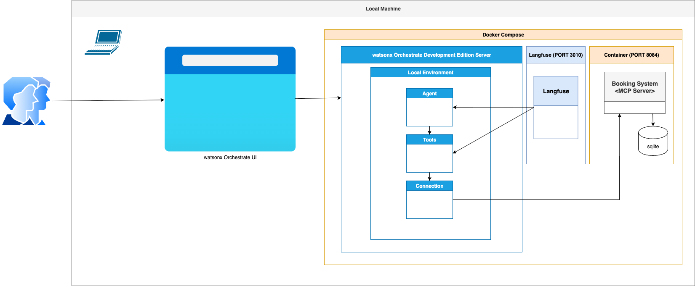

# End to End Agent Use Case Implementation with Galaxium Travels: Full Local Setup Guide and MCP 

_Galaxium Travels local MCP Server, `watsonx Orchestrate Development Edition`, and `Docker-Compose`_

This repository demonstrates how to set up a `MCP server` locally and integrate it into the `watsonx Orchestrate Development Edition` using `Docker-Compose`.

* **MCP Server**



This repository contains resources for the "galaxium_travels_mcp-compose-watsonx-orchestrate" project, utilizing the `watsonx Orchestrate Development Edition`.

* Galaxium Travels Applications:
    * Galaxium Travels Booking MCP: http://localhost:8084/mcp
    * Galaxium Travels WebApp: http://localhost:8083
    * Galaxium Travels Booking: http://localhost:8082/docs
    * Galaxium Travels HR: http://localhost:8081/docs

* watsonx Orchestrate 
    * Langfuse: http://localhost:3010
    * watsonx Orchestrate LiteChat: http://localhost:3000

* Related resources:

    * [YouTube video: Galaxium + MCP + watsonx Orchestrate: Full Local Setup Guide](https://www.youtube.com/watch?v=LRIAkzVrIvc) to the following steps.

#### 0. Clone this repository to your local machine

This is to ensure you use the same folder structure as defined in the following documentation.

```sh
git clone https://github.com/thomassuedbroecker/galaxium-travels-mcp-compose-watsonx-orchestrate.git
cd galaxium-travels-mcp-compose-watsonx-orchestrate
```

* Inspect the folder structure:

```sh
tree .
.
├── 1-galaxium_setup.md
├── 2-watsonx_adk_setup.md
├── 3-connect-to-the-mcp-server-with-mcp-inspector.md
├── 4-connect-to-the-mcp-server.md
├── example-application-infrastructure
│   └── README.md
├── images
│   ├── connect-to-mcp-locally-01.jpg
│   ├── connect-to-mcp-locally-02.jpg
│   ├── connect-to-mcp-locally-03.jpg
│   └── mcp-server-overview-01.png
├── LICENSE
├── README.md
└── watsonx-orchestrate-adk
    └── README.md
```

#### 1. Start your container engine

Ensure your container engine is running on your desktop.
[Configuring container manager](https://developer.watson-orchestrate.ibm.com/developer_edition/wxOde_setup#configuring-container-manager)

_Additional information:_

* Docker Desktop (tested only on Mac OS):
    - Kubernetes must be enabled, Settings -> Kubernetes -> Enable Kubernetes, leave the rest by default (kubeadm is sufficient)
    - Start Docker Desktop neurally
    - Enter the `.kube` directory from your home directory under `Settings -> Resources -> File sharing` (i.e. /Users/<username>/.kube)

#### 2. [Set up the example `Galaxium Travels Infrastructure`](https://github.com/IBM/oic-i-agentic-ai-tutorials/blob/main/end-to-end-agent-use-case-implementation-with-galaxium-travels-full-local-setup-guide-and-mcp/1-galaxium_setup.md)

#### 3. [Set up the watsonx Orchestrate ADK and watsonx Orchestrate Development Server](https://github.com/IBM/oic-i-agentic-ai-tutorials/blob/main/end-to-end-agent-use-case-implementation-with-galaxium-travels-full-local-setup-guide-and-mcp/2-watsonx_adk_setup.md)

#### 4. [Connect to the MCP server with MCP inspector](https://github.com/IBM/oic-i-agentic-ai-tutorials/blob/main/end-to-end-agent-use-case-implementation-with-galaxium-travels-full-local-setup-guide-and-mcp/3-connect-to-the-mcp-server-with-mcp-inspector.md)

#### 5. [Connect to MCP Gateway and MCP server](https://github.com/IBM/oic-i-agentic-ai-tutorials/blob/main/end-to-end-agent-use-case-implementation-with-galaxium-travels-full-local-setup-guide-and-mcp/4-connect-to-the-mcp-server.md) 

#### 6. Additional resources

* **The Galaxium Travels Example**   
    * [Galaxium Travels Infrastructure](https://github.com/thomassuedbroecker/galaxium-travels-infrastructure)
    * [Galaxium Travels Idea](https://github.com/Max-Jesch/galaxium-travels)
    * [Galaxium Travels Embedded Webchat Example](https://github.com/thomassuedbroecker/galaxium_travels_embedded_webchat_example)
    * [Galaxium Travels Evaluation Example](https://github.com/thomassuedbroecker/galaxium_travels_evaluation_example)
    * [Galaxim Travels Knowledge Graph RAG example](https://github.com/thomassuedbroecker/galaxium-travels-graph-rag-watsonx-ai-example)


* **Blog posts**

    * [Integrating watsonx Orchestrate Agent Chat in Web Apps](https://suedbroecker.net/2025/08/08/integrating-watsonx-orchestrate-agent-chat-in-web-apps/)
    * [Getting Started with Local AI Agents in the watsonx Orchestrate Development Edition](https://suedbroecker.net/2025/06/25/getting-started-with-local-ai-agents-in-the-watsonx-orchestrate-developer-edition/)
    * [`Building Agentic AI solutions with WatsonX Orchestrate and Remote MCP Servers: A Weather Tool Example`](https://medium.com/@rishraj.2000/building-agentic-ai-solutions-with-watsonx-orchestrate-and-remote-mcp-servers-a-weather-tool-4dc795de76bb)
    * [Converting SSE to STDIO via the MCP Gateway](https://heidloff.net/article/mcp-gateway/)

* **ADK documentation**
    * [Importing remote MCP toolkits](https://developer.watson-orchestrate.ibm.com/tools/toolkits/remote_mcp_toolkits#using-streamable-http)
    * [IBM watsonx Orchestrate Agent Development Kit](https://developer.watson-orchestrate.ibm.com/)

* **MCP documentation**
    * [Transports](https://modelcontextprotocol.io/specification/2025-06-18/basic/transports)
