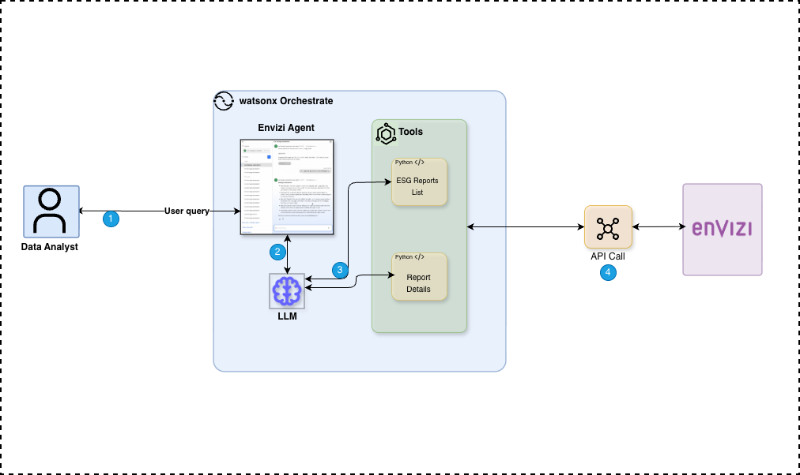

# watsonx Orchestrate Envizi Agent

This solution integrates **IBM watsonx Orchestrate** with the **Envizi ESG platform** to automate sustainability data management and reporting workflows.

Envizi provides powerful capabilities for environmental, social, and governance (ESG) data collection, analysis, and reporting. By combining Envizi with watsonx Orchestrate’s automation and conversational AI capabilities, organizations can streamline ESG processes and deliver insights faster.

---

## Key Capabilities

This integrated solution empowers sustainability teams to:

- **Automate repetitive ESG reporting workflows**  
  Reduce manual effort by allowing digital workers to fetch and process Envizi data on demand.

- **Accelerate insight generation from environmental data**  
  Enable quick access to Envizi reports directly through chat-based interactions.

- **Ensure compliance with sustainability frameworks**  
  Standardize how ESG data is collected, validated, and presented.

- **Enhance collaboration across functions**  
  Let business teams interact with ESG data using natural language through intelligent digital workers.

---

## Architecture

The diagram below illustrates how ESG and sustainability reports are securely retrieved from the Envizi platform using watsonx Orchestrate and the Python-based integration tools.

---
