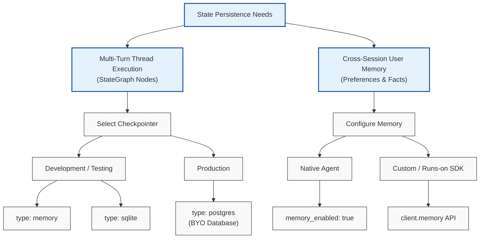

# IBM watsonx Orchestrate (wxO): Memory & Checkpointers Architectural Guide

This guide provides a comprehensive technical overview of state management, long-term memory persistence, and thread checkpointing mechanisms within IBM watsonx Orchestrate (wxO).

---

## Executive Summary: State Management Paradigms

In watsonx Orchestrate, state management is partitioned into two distinct paradigms serving complementary operational requirements:

| Aspect | Checkpointers (Thread State) | Agent Memory (User Memory) |
| :--- | :--- | :--- |
| **Scope** | Single conversation thread / session | Global across all threads & agents for a user |
| **Target Architecture** | LangGraph & Runs-On Custom Agents | Native Agents & SDK Custom Agents |
| **Primary Purpose** | Preserves execution graph state & turn history | Stores user facts, preferences, and entity knowledge |
| **Duration** | Ephemeral (dev) to Thread Lifetime (prod) | Long-term persistent across sessions |
| **Managed DBs** | In-Memory / SQLite (wxO managed) or External PostgreSQL | Managed by wxO Memory Microservice APIs |

---

## Part 1: User-Scoped Agent Memory Feature

### 1. Architectural Overview
The **Memory feature in wxO** enables agents to persist and retrieve user-specific context (e.g., identity facts, preferences, prior outcomes) across conversation sessions and across different agents interacting with the same user.

#### Core Principles
* **User-Scoped (Global)**: Memory belongs to the end-user profile rather than a specific agent or isolated chat session.
* **Cross-Agent Knowledge Sharing**: Memories stored by Agent A can be queried and utilized by Agent B for the same user.
* **Privacy & User Control**: Users can inspect, delete individual items, or purge all memories via the Web Chat UI or SDK APIs.

---

### 2. Supported Memory Categories (`memory_type`)

wxO memory organizes information into structured categories:

| Canonical Type | Aliases | Intended Content |
| :--- | :--- | :--- |
| `preference` | `preferences` | User choices (e.g., preferred contact method, UI dark mode). |
| `profile_fact` | `profile`, `identity` | Attributes & identity details (e.g., job role, company name). |
| `conversational` | `conversation`, `fact`, `episodic` | Contextual facts extracted from message exchanges. |
| `outcome` | `derived_event` | Workflow outputs, ticket updates, or execution results. |
| `tool` | `task`, `procedure` | Actionable tool parameters or procedural instructions. |

---

### 3. Native Agent Configuration

For native agents defined via YAML specifications (`kind: native`), memory management is enabled using the `memory_enabled` boolean property:

```yaml
spec_version: v1
kind: native
name: hr_assistant_agent
title: HR Virtual Assistant
llm: watsonx/ibm/granite-3-8b-instruct
style: default
memory_enabled: true  # Enables automatic cross-turn conversation retention
instructions: |
  You are an HR virtual assistant. Use memory to recall user profile details and preferences.
```

---

### 4. SDK Memory Implementation (Custom & LangGraph Agents)

Custom agents running in the **runs-on** runtime interact with the memory service using `ibm_watsonx_orchestrate_sdk.Client`.

#### Initializing the Client
```python
from ibm_watsonx_orchestrate_sdk import Client

def my_agent_node(state, config):
    # Initialize SDK client from the execution RunnableConfig
    client = Client.from_runnable_config(config)
```

#### Writing to Memory (`add_messages`)
Memory can be written deterministically or via backend LLM inference extraction:

```python
# Deterministic explicit write
client.memory.add_messages(
    messages=[{"role": "user", "content": "I prefer email for urgent notifications."}],
    memory_type="preference",
    infer=False,
    metadata={"source": "user_settings_node"}
)

# Automated extraction (infer=True / default)
client.memory.add_messages(
    messages=state["messages"],
    infer=True  # Backend infers key facts/entities from full dialogue window
)
```

#### Searching & Retrieving Memory
```python
# Semantic search over user memories
search_response = client.memory.search(
    query="user notification preferences",
    memory_type="preference",
    limit=3
)

for result in search_response.results:
    print(f"Content: {result.content}")
```

#### Memory Management APIs
```python
# List memories
user_memories = client.memory.list(limit=50)

# Delete specific memory
client.memory.delete(memory_id="mem-uuid-12345")

# Purge all memories for current user
client.memory.delete_all()
```

---

### 5. Web Chat UI Integration

To enable end-user memory visibility and controls in the chat interface, configure `showAgentMemory` in the front-end initialization script:

```javascript
window.wxOConfiguration = {
  orchestrationID: "your-tenant-id",
  hostURL: "https://your-host-url",
  chatOptions: {
    agentId: "hr_assistant_agent",
    agentEnvironmentId: "production"
  },
  features: {
    showAgentMemory: true, // Displays Memory Manager button in side panel
    showThreadList: true
  }
};
```

---

## Part 2: Thread Checkpointers (LangGraph Agents)

### 1. Purpose of Checkpointers
Checkpointers serialize and save the internal state of **LangGraph agents** at every step (node execution) of a workflow graph. This enables:
* Multi-turn state persistence across user input cycles.
* State recovery following pod or service container restarts.
* Execution replay, branching, and debugging.

---

### 2. Checkpointer Types & Database Hosting Details

| Checkpointer Type | Hosted / Provided by wxO? | Persistence Level | Recommended Environment |
| :--- | :--- | :--- | :--- |
| **`memory`** | **Yes** (RAM) | Process lifespan (Lost on restart) | Local testing / Unit tests |
| **`sqlite`** | **Yes** (Container Disk) | Container lifespan (Lost on pod restart) | Development / Single-pod staging |
| **`postgres`** | **NO** (Bring Your Own Database) | Durable & Multi-pod scalable | **Production** |

---

### 3. Deep-Dive: Checkpointer Modes

#### A. In-Memory Checkpointer (`memory`)
* Configured in agent deployment spec:
  ```yaml
  checkpointer:
    type: memory
  ```
* **Pros**: Zero dependencies, fastest performance.
* **Cons**: Ephemeral. All state resets when the agent process restarts.

#### B. SQLite Checkpointer (`sqlite`)
* Configured in agent deployment spec:
  ```yaml
  checkpointer:
    type: sqlite
  ```
* **Requirements**: Include `langgraph-checkpoint-sqlite` in `requirements.txt`.
* **Database Hosting**: Managed internally by wxO within the container filesystem. No credential configuration required.
* **Cons**: Non-durable in cloud multi-pod deployments.

#### C. PostgreSQL Checkpointer (`postgres`)
* Configured in agent deployment spec:
  ```yaml
  checkpointer:
    type: postgres
    connection_string_key: db_connection_string
  ```
* **Requirements**: 
  1. Include `langgraph-checkpoint-postgres` in `requirements.txt`.
  2. Provision a PostgreSQL instance (e.g. AWS RDS, Azure Database, IBM Cloud DB for PostgreSQL, or self-hosted).
  3. Store the Postgres URI connection string in wxO Credentials using the key specified (`db_connection_string`).
* **Automated Management**: Once credentials are linked, wxO handles database connection pooling, table initialization, and schema migrations automatically inside your PostgreSQL instance.

---

## Summary & Decision Matrix



---
*Document Created: July 2026 | IBM watsonx Orchestrate Architectural Guide*
