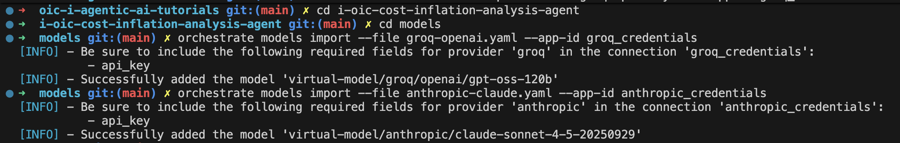
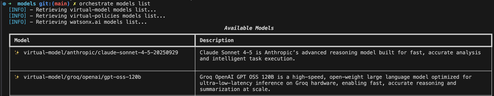
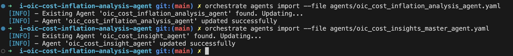

# i-oic-cost-inflation-analysis-agent

## Steps Overview
This tutorial demonstrates how an agent uses Groq for IBM watsonx Orchestrate , it provides a single-tenant cloud service where dedicated racks are provisioned exclusively for each user. This configuration enables the deployment of specific supported models that are selected by you, including compatible Bring Your Own Model (BYOM) options.

### Why Groq ?
Groq delivers ultra-low-latency, high-throughput AI inference through its innovative LPU (Language Processing Unit) architecture, enabling real-time reasoning and faster model execution at dramatically lower power and cost. By integrating Groq’s compute acceleration with IBM watsonx and Granite foundation models, enterprises gain the ability to deploy near-instant, on-prem or edge AI inference for mission-critical use cases - from financial analysis to conversational agents.

https://www.ibm.com/docs/en/watsonx/watson-orchestrate/base?topic=entitlements-licenses-groq

---

### Create Agents

In this tutorial , you will build an AI agent in watsonx Orchestrate that:
- Uses Groq's LLM to reason and orchestrate.
- Calls an agent that run those queries using Anthropic Clause Sonnet Model.
- Displays the summarized results via tool leveraging IBM Granite's nano Model.

---

## Step 1: Create Connections

In this step , you will Create a **connection** to Groq and Anthropic. These credentials will also be used when importing the external model in watsonx Orchestarte.

```
orchestrate connections add -a groq_credentials
orchestrate connections configure -a groq_credentials --env draft -k key_value -t team
orchestrate connections set-credentials -a groq_credentials --env draft -e "api_key=grok-api-key"

orchestrate connections configure -a groq_credentials --env live -k key_value -t team
orchestrate connections set-credentials -a groq_credentials --env live -e "api_key=grok-api-key"


orchestrate connections add -a anthropic_credentials
orchestrate connections configure -a anthropic_credentials --env draft -k key_value -t team
orchestrate connections set-credentials -a anthropic_credentials --env draft -e "api_key=anthropic_api_key"

orchestrate connections configure -a anthropic_credentials --env team -k key_value -t team
orchestrate connections set-credentials -a anthropic_credentials --env team -e "api_key=anthropic_api_key"


```
## Step 2: Import External LLM

In this tutorial, you'll import the Clause Sonnet and GPT OSS model. You can configure another model of your choice.
List to view if the model is imported properly or not .
**Note**: Please find the list of supported LLM providers [here](https://developer.watson-orchestrate.ibm.com/llm/managing_llm).



```

orchestrate models import --file groq-openai.yaml --app-id groq_credentials

orchestrate models import --file anthropic-claude.yaml --app-id anthropic_credentials

orchestrate models list

```


## Step 3: Import Tools

This step imports a tool that passes the analysis from an agent to the tool for summarization


```
orchestrate tools import -k python -f oic_granite_summary_tool.py -r requirements.txt
```

### Step 4 : Import Agents
In this step, you'll import the agent that:
- Uses Groq platform for reasoning .
- Uses the external LLM for inferencing ie.e Anthropics Clause Sonnet.

```
orchestrate agents import --file oic_cost_inflation_analysis_agent.yaml 

orchestrate agents import --file oic_cost_insights_master_agent.yaml

```


## Conclusion 
In this tutorial, you:

- Imported an external LLM (e.g., GPT OSS 120B, Claude Sonnet )

```
curl --request POST \
  --url "https://sai-vllm-vllm.apps.6913556aa0a1cb9f21cd70d7.eu1.techzone.ibm.com/v1/chat/completions" \
  --header "Content-Type: application/json" \
  --data '{
    "model": "ibm-granite/granite-4.0-350m",
    "messages": [
      {
        "role": "user",
        "content": "## Netflix Streaming Platform - Cost Inflation Details\n\nHere'\''s a comprehensive breakdown of Netflix'\''s pricing evolution and cost inflation:\n\n### Price History (U.S. Standard Plan)\n\n| Year | Price | Previous Price | YoY Inflation | User Sentiment |\n|------|-------|----------------|---------------|----------------|\n| 2022 | $13.99 | $13.99 | 0.0% | Neutral - \"Great content library but getting expensive\" |\n| 2023 | $15.49 | $13.99 | 10.72% | Negative - \"Another price hike? Considering canceling\" |\n| 2024 | $15.49 | $15.49 | 0.0% | Neutral - \"At least they didn'\''t raise prices this year\" |\n| 2025 | $17.99 | $15.49 | 16.14% | Negative - \"This is getting ridiculous, quality hasn'\''t improved\" |\n\n### Key Metrics\n\n- Total Price Increase (2022-2025): $4.00\n- Cumulative Inflation: ~28.6%\n- Average Inflation (years with price hikes): ~13.4% per year\n- Price Stability: No changes in 2022 & 2024\n\n### Analysis Highlights\n\n- 2023: First major increase of 10.7%\n- 2024: Price held steady\n- 2025: Steepest increase at 16.1%\n- Sentiment: Negative during price hikes\n\n---\n\nNetflix (U.S. – Standard plan) – Price-inflation overview\n\n| Year (Jan) | Price (USD) | Prior price (USD) | YoY inflation % | Comment |\n|------------|-------------|-------------------|------------------|---------|\n| 2022 | 13.99 | 13.99 | 0.0% | Neutral |\n| 2023 | 15.49 | 13.99 | 10.72% | Negative |\n| 2024 | 15.49 | 15.49 | 0.0% | Neutral |\n| 2025 | 17.99 | 15.49 | 16.14% | Negative |\n\n*Inflation formula: ((current - previous) / previous) * 100*\n\n---\n\n### Key take-aways\n\n- Total increase: $4.00\n- Cumulative inflation: 28.6%\n- Avg inflation (years with hikes): 13.4%\n- No-change years: 2022 & 2024\n- Sentiment: Neutral → Negative when prices rise\n\n---\n\n### Summary\n\nPrices increased sharply in 2023 and 2025, causing negative sentiment. 2024 remained flat, improving user perception.\n"
      }
    ],
    "stream": false
  }'
```

This setup enables low-code, LLM-driven access to your data — directly within IBM watsonx Orchestrate.

## Tips

- Make sure all dependencies in requirements.txt are available during tool import.
- Always test tools independently before wiring them into an agent.