# Steps to deploy application on Code Engine using ICR

## Clone the git repo and ensure the code is running

1.  Clone the github repo in desired local folder.
```
git clone https://github.com/IBM/oic-i-agentic-ai-tutorials.git
```

2.  Set the Current working directory (CWD) to
    the folder where **Dockerfile** is located. 
    
    E.g: In the above repo, Dockerfile is in "backend_code" folder
```
cd oic-i-agentic-ai-tutorials/i-oic-integrate-headless-ai-agent/backend_code
```

3.  Create an **.env** file in CWD with the variables defined in "env.sample" with actual values.

4.  Install the required dependencies

```
pip install -r requirements.txt
```

5.  Run the app using Uvicorn. In the reference repo, the entry file is **main.py** inside the **api** folder, so use:
```
uvicorn api.main:app --reload --port 8080
```
## Build the container image using Podman

> Note: Github code should contains the Dockerfile, which is required to
> build the image.

1.  Ensure podman is initialized and started.

```
podman machine init

podman machine start
```

2.  Build the image

```
podman build -t <name of app> .

```

3.  Run the container image

```
podman run -p 8080:8080 <name of app>
```

> Note:

1.  Execute the above commands in the CWD where Dockerfile is located.

2.  Exposed Port can be checked in the "Dockerfile"

3.  The command maps port 8080 on your local machine to the exposed container\'s port 8080, allowing you to access the backend_code app
    in your browser by navigating [here](http://localhost:8080/docs)

> If the build is successful and working as expected, we can deploy the
> container image to IBM Container Registry.

## Push the image to ICR using terminal

1.  Install **ibmcloud** CLI and **container-registry** plugin

> On Mac, execute the following command in terminal to install ibmcloud

```
curl -fsSL https://clis.cloud.ibm.com/install/osx | sh
```
> To install the "container-registry" plugin, execute the following
> command:

```
ibmcloud plugin install container-registry
```

2.  Open the terminal and run following command to login to IBM Cloud. A
    link will open in the browser copy that one time code.

```
ibmcloud login --sso
```

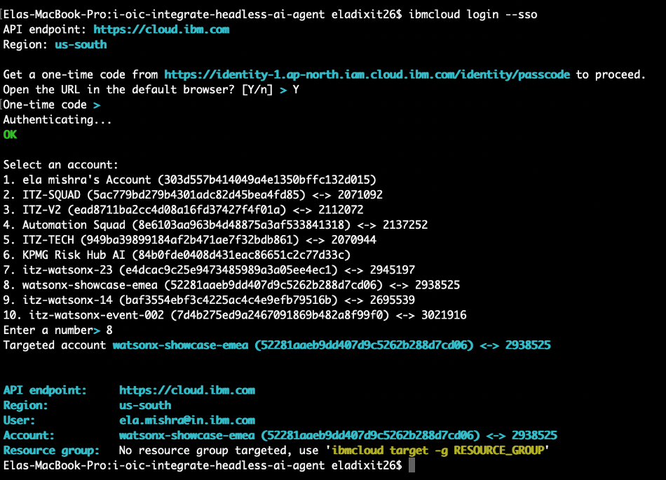


3.  Check the active service resources to verify the ICR
```
 ibmcloud resource service-instances
```
4.  Check the current region and API endpoint of the ICR

```
ibmcloud cr info
```

 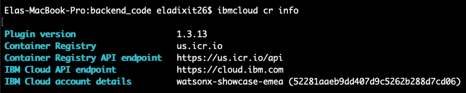
>
> NOTE: By default, region is set to global, i.e. "icr.io". We need to
> set the region in which ICR is reserved. E.g: if the region is
> "London", then the region will be eu-gb. 

5.  Set the correct region where the ICR is reserved
```
 ibmcloud cr region-set <region code>
 ```

Following are the regions, for this tutorial, you will use **us.icr.io**

> 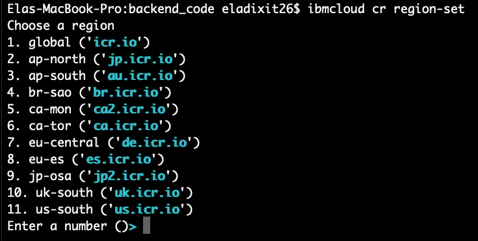

6.  Validate the namespace for ICR in the set region

```
ibmcloud cr namespace-list
```

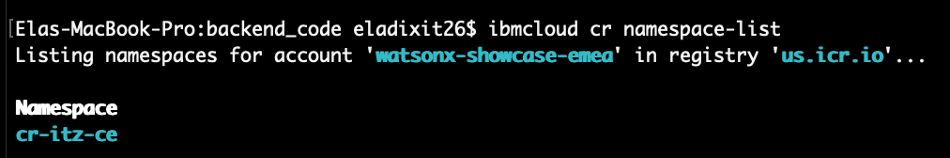


7.  Login to the region using Podman

```
ibmcloud cr login --client podman
```

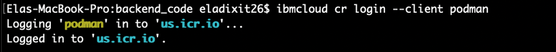

8.  Tag the image

```
podman tag <source_image>:<tag> <region>.icr.io/<my_namespace>/<new_image_repo>:<new_tag>

E.g: 
podman tag backend_code:latest us.icr.io/cr-itz-ce/backendcode_image:latest
```
9.  Push the image to ICR

```
podman push <region>.icr.io/<my_namespace>/<new_image_repo>:<new_tag>

E.g: podman push backend_code:latest us.icr.io/cr-itz-ce/backendcode_image:latest
```

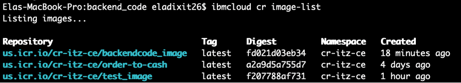

10. Verify the image was pushed successfully

```
ibmcloud cr image-list
```


## Deploy the application in Code Engine

1.  Login to [IBM Cloud](https://cloud.ibm.com/login) user interface.
2.  Navigate to Hamburger Menu -> Containers -> Images . You can see the image that was
    pushed through commands .

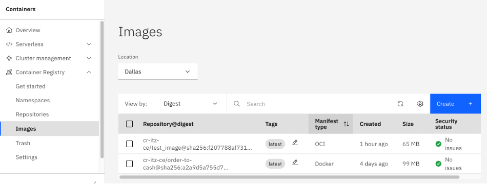

3.  Navigate to Resource List -> Containers -> Code Engine . Click on code engine .

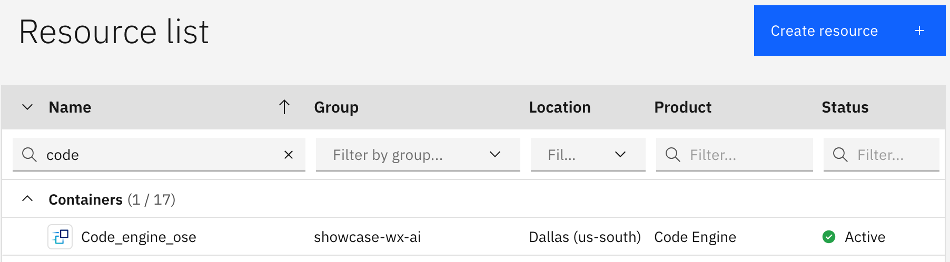

4.  In this next step , you will create an **Application** . Navigate to  **Code Engine -> Applications -> Create**

5.  Select **Use an existing image**

-   In Image Reference, provide the ICR image description for the image.
    **us.icr.io/cr-itz-ce/backendcode_image:latest**
-   Click on **Configure the image**: Using **us.icr.io/cr-itz-ce/test_image:latest** as reference enter following values:

    1. Registry server : us.icr.io
    2. Namespace : cr-itz-ce
    3. Repository: backend_code_image
    3. Tag : latest
    4. Secret : Create a Registry secret with the following configuration:
        - Target Registry: Other
        - Registry server: <Image registry server> 
        - Username: iamapikey
        - Password: [IBM Cloud Account API Key](https://www.ibm.com/docs/en/masv-and-l/cd?topic=cli-creating-your-cloud-api-key)

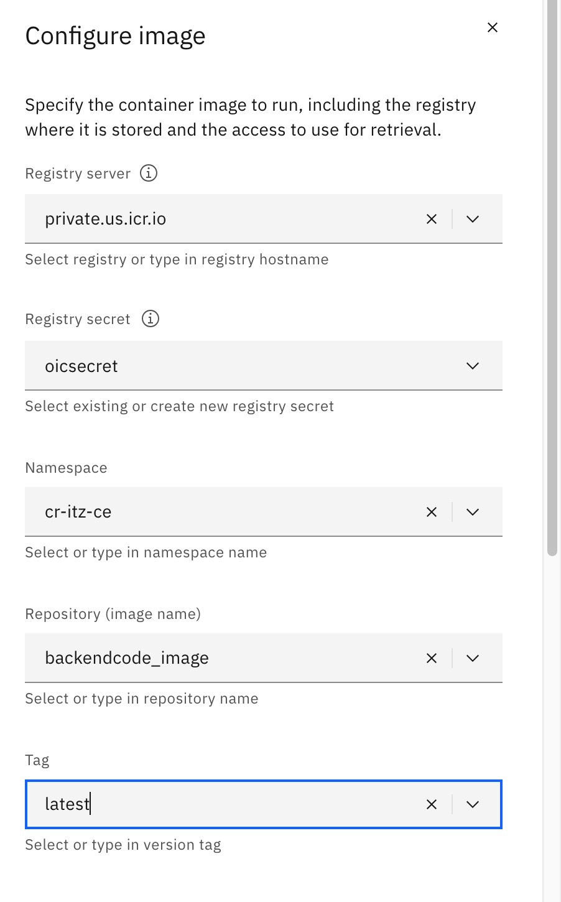

6.  Resource and Scaling

    1. CPU and Memory: 1 vCPU/ 4GB
    2. Ephemeral storage: 4 GB
    3. Min no. of instances: 1
    4. Max no. of instances: 1
    5. Rest of the settings in this section can be left as is.

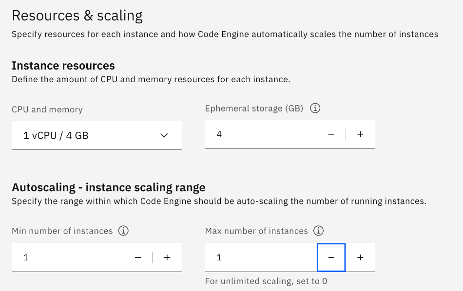

7.  Image start options

    - Listening Port: In the github repo, check the Dockerfile and look out for EXPOSE <Port> statement. 
    - Copy the Port number and paste it as the Listening Port.

8.  You've successfully completed the steps to deploy an application to code engine. You can review the details of the build in "Instances".

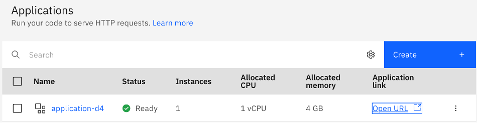

9.  Test the deployed application . Click on **Open URL** . Append **/docs** to the URL to view the deployed FastAPI .

https://application-d4.1ucys990xy44.us-south.codeengine.appdomain.cloud/docs

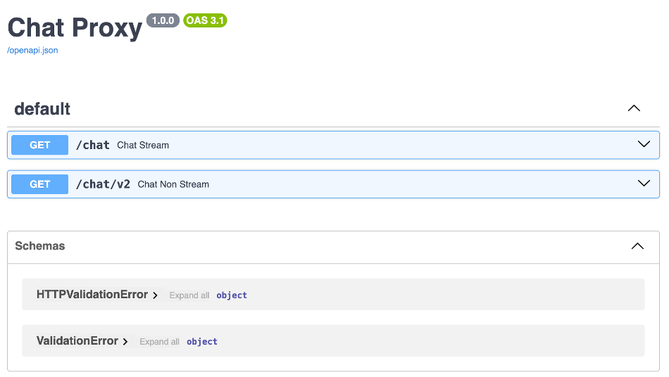

You've successfully completed the steps to deploy an application to code engine. 