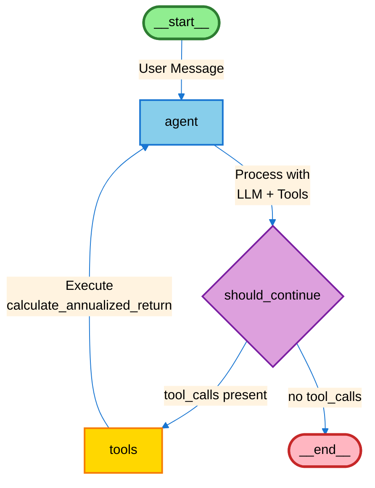
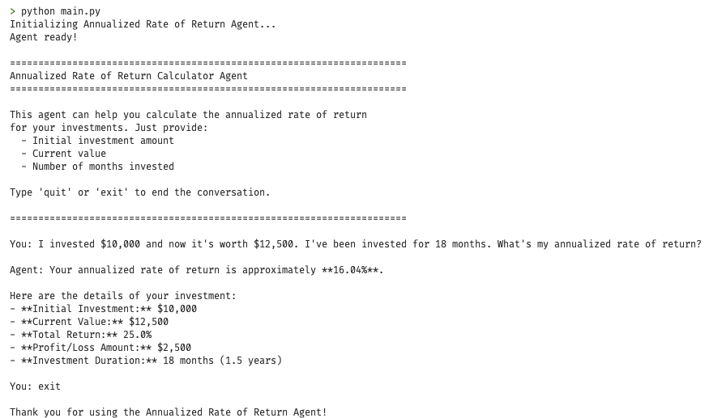
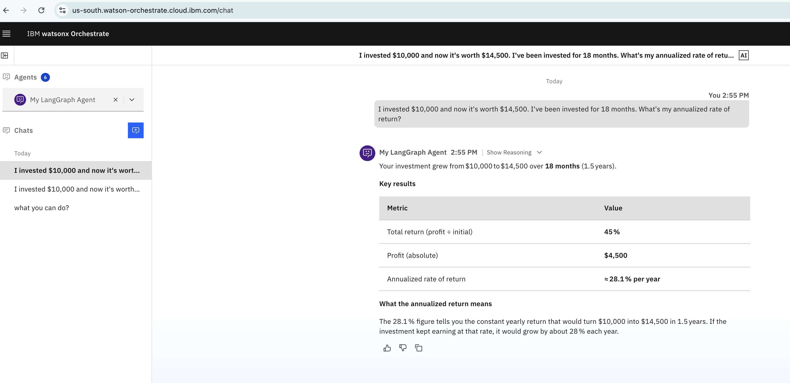

# Run Your Custom LangGraph Agents Within watsonx Orchestrate Runtime Environment  

As an Enterprise AI Architect, one of our core goals is to industrialize agentic AI without creating a fragmented runtime landscape. Many organizations already have custom LangGraph agents developed by innovation teams, line-of-business developers, or partner ecosystems. The challenge is not whether these agents exist—it is how to operationalize them within a governed, scalable, enterprise-grade runtime.

watsonx Orchestrate addresses this need by allowing us to import custom LangGraph agents and run them inside the WXO agent runtime. This provides a strong value proposition: We can preserve prior investments in custom agent logic while consolidating execution, security, model access, governance, and operations within a single enterprise platform. Instead of maintaining separate hosting stacks for bespoke LangGraph agents, we can bring them into WXO and manage them as part of our broader AI architecture.

This capability is especially valuable when designing enterprise agent ecosystems because it helps you:
- Reuse existing LangGraph assets rather than rebuilding them from scratch
- Standardize runtime operations across native and imported agents
- Centralize credentials, model access, and environment management
- Improve governance, scalability, and operational consistency
- Reduce the complexity and cost of supporting multiple agent runtimes

This tutorial shows how to take a custom LangGraph agent, adapt it for compatibility, and run it within the watsonx Orchestrate runtime environment.

First, we will create and run a simple LangGraph agent in standalone mode. Then we will make the required code adjustments to import that LangGraph agent into WXO so it can execute within the WXO agent runtime.

## Architecture

Understanding the architecture is key to successfully deploying LangGraph agents within watsonx Orchestrate. The diagram below illustrates how a custom LangGraph agent integrates with the WXO platform:


The architecture demonstrates how your custom LangGraph agent, along with its associated tools, executes within the WXO agent runtime and connects to either internal or external language models.


1. **User Initiation**: The user initiates a conversation through the WXO web chat interface
2. **Request Routing**: The user request is routed to the LangGraph agent
3. **Request Processing**: The LangGraph agent processes the request using internal or external LLM reasoning and determines whether a tool call is required
4. **Tool Execution**: If needed, the agent invokes the appropriate tool and receives the tool response
5. **Response Generation**: The agent uses LLM reasoning to synthesize the tool output and generate a comprehensive response
6. **Response Delivery**: The final response is delivered to the user through the chat interface

**Note:** The WXO agent runtime manages the complete lifecycle of your agent, including:
- Agent initialization and configuration
- Conversation state management
- Security and authentication
- Scaling and resource allocation
- Error handling and retries
- Logging and monitoring


### Benefits of This Architecture

- **Unified Runtime**: No need to manage separate agent infrastructure
- **Model Flexibility**: Easy switching between different LLM providers
- **Secure Credentials**: Centralized, secure credential management
- **Enterprise Ready**: Built-in scaling, monitoring, and governance
- **Cost Optimization**: Shared infrastructure reduces operational costs

## Getting Started  

## Prerequisites

- An active watsonx Orchestrate instance (local developer edition or IBM Cloud hosted instance)
- A running local environment of the watsonx Agent Development Kit (ADK) to configure connections and agents using the CLI. If you do not have an active ADK instance, review the [getting started with ADK tutorial](https://www.ibm.com/docs/en/watsonx/watson-orchestrate/current?topic=started-getting-adk). This tutorial has been tested and validated with ADK version 2.2.0.
- Python version between 3.11.x to 3.13.x installed on your local machine
- An OpenAI API key (for the standalone version). You can obtain one by creating an account at [platform.openai.com](https://platform.openai.com) and navigating to 'Create API key' section.
- To follow this tutorial, clone the repository and navigate to the tutorial folder:

```bash
git clone https://github.com/IBM/oic-i-agentic-ai-tutorials.git
cd oic-i-agentic-ai-tutorials/i-oic-langgraph-agent
```

**Repository:** [IBM/oic-i-agentic-ai-tutorials](https://github.com/IBM/oic-i-agentic-ai-tutorials)


## Part 1: Creating and running a standalone LangGraph Agent

In this section, we'll create a simple LangGraph agent that calculates the annualized rate of return for investments.

### Step 1: Set Up Your Project Directory

Make sure you are in `langraph-wxo-demo` directory. You can open it in your preferred IDE like vscode and get a working terminal.

### Step 2: Set up python virtual environment

Create and activate a Python virtual environment:

```bash
# Create virtual environment
python -m venv .venv

# Activate virtual environment
# On macOS/Linux:
source .venv/bin/activate

# On Windows:
.venv\Scripts\activate
```

Install the dependencies:

```bash
pip install -r requirements.txt
```

You should see output indicating that all packages are being installed, including the watsonx Orchestrate ADK.

### Step 3: Set up environment 

Create a `.env` file to store your API keys:

```bash
# .env
OPENAI_API_KEY=your-openai-api-key-here
```


### Step 4: Understanding the LangGraph Agent Flow

Before testing the agent, let's visualize how it works. The diagram below shows the agent's execution flow as implemented in the code:



This ReAct (Reasoning + Acting) pattern allows the agent to iteratively reason about problems and take actions (tool calls) until it has enough information to provide a complete answer.

### Step 5: Test the Standalone Agent

Run the agent:

```bash
python main.py
```

Try asking questions like:
- "I invested $10,000 and now it's worth $12,500. I've been invested for 18 months. What's my annualized rate of return?"
- "Calculate the annualized return for an initial investment of $5000, current value of $6200, over 24 months."

The agent should use the `calculate_annualized_return` tool to perform the calculations and provide detailed responses.



## Part 2: Adapting the Agent for watsonx Orchestrate

Now that we have a working standalone agent, let's adapt it to run within the watsonx Orchestrate runtime environment. `my_langraph_agent` directory contains all the modified files to run the agent in the watsonx Orchestrate environment.

### Step 1: Create the WXO Agent Directory

make sure you are in my_langraph_agent directory:

```bash
cd my_langraph_agent
```
### Step 2: Understand the code modifications 

Please go through the inline comments in the code files to understand the changes made for WXO compatibility.

### Step 3: Import the Agent into WXO

Run the setup script:  

Note: Make sure you are connected to remote WXO saas instance.   

```bash
./import_to_wxo.sh
```

**What happens when you run this script:**

1. **Interactive Prompts**: You'll be asked to enter:
   - Your WXO instance URL (e.g., `https://your-instance.watsonx.orchestrate.ibm.com`)
   - Your WXO API key (input will be hidden for security)

2. **Connection Creation**: Creates a connection named `wxo_langgraph` that stores your WXO credentials

3. **Environment Configuration**: Sets up the connection for both:
   - **Draft environment**: For development and testing
   - **Live environment**: For production deployment

4. **Credential Storage**: Securely stores your credentials in WXO's connection manager

5. **Agent Import**: Uploads your agent code and configuration to WXO

6. **Connection Linking**: Associates your agent with the connection so it can access credentials at runtime

After successful execution, your agent will be ready to use in the WXO platform!

### Step 8: Test the Agent in WXO

Once imported, you can test your agent in the watsonx Orchestrate UI:

1. Navigate to your WXO instance
2. Go to the Agents section
3. Find "my_langraph_agent"
4. Start a conversation and ask questions like:
   - "I invested $10,000 and now it's worth $12,500. I've been invested for 18 months. What's my annualized rate of return?"

The agent will now run within the WXO runtime environment, using WXO's model infrastructure and connection management.



## Summary

This tutorial walked you through the complete journey of building a custom LangGraph agent and deploying it to watsonx Orchestrate. You started by creating a standalone agent that calculates investment returns, complete with its own tools and interactive interface. This gave you a working agent that runs independently on your local machine.

Next, you learned how to adapt that same agent to run within the watsonx Orchestrate platform. The key changes involved connecting to WXO's model infrastructure, using WXO's credential management system, and packaging everything according to WXO's requirements. These modifications allow your agent to benefit from WXO's enterprise features like centralized security, scalability, and governance.

Finally, you deployed your agent to WXO using an automated script that handles all the setup steps. Once deployed, your agent runs in a managed environment where it can be easily accessed, monitored, and integrated with other enterprise systems. This approach lets you preserve your custom agent logic while gaining all the advantages of an enterprise AI platform.


## Acknowledgments  

This tutorial is produced as part of an IBM Open Innovation Community initiative : Agentic AI (AI for Developers and Ecosystem).

The authors deeply appreciate the support of Jerome Joubert (jerome.joubert@fr.ibm.com) for technical guidance on making langraph agent works in wxo environment and technical reviewer Ela Dixit(https://www.linkedin.com/in/ela-dixit/) for thorough reviews and insightful feedback.  

The authors also extend their sincere thanks to Michelle Corbin for her editorial guidance and support, which significantly enhanced the clarity and quality of this tutorial.

For more information, visit the [watsonx Orchestrate documentation](https://www.ibm.com/docs/en/watsonx/watson-orchestrate).
