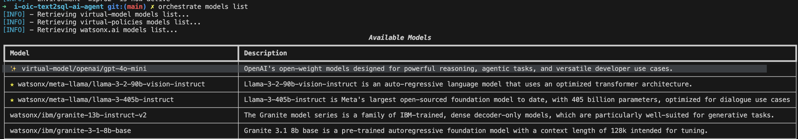
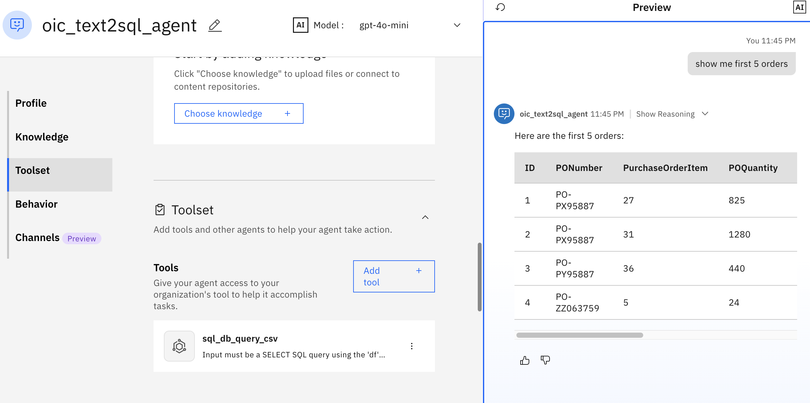

# i-oic-text2sql-ai-agent

## Steps Overview
This tutorial demonstrates how to integrate an external third-party Large Language Model (LLM) with AI agents built and deployed on IBM watsonx Orchestrate (WXO).

### Create Text2SQL Agent

In this tutorial , you will build an AI agent in watsonx Orchestrate that:
- Uses an external LLM gpt-mini-4o to convert natural language instructions into well defined SQL queries.
- Uses a tool to run those queries and fetch data .
- Displays the results on a conversational interface.

---

## Step 1: Create Connections

In this step , you will Create a **connection** to OpenAI. These credentials will also be used when importing the external model in watsonx Orchestarte.

```
orchestrate connections add -a openai_creds

orchestrate connections configure -a openai_creds --env draft -k key_value -t team

orchestrate connections set-credentials -a openai_creds --env draft -e "api_key=YOUR_API_KEY"

```
## Step 2: Import External LLM

In this tutorial, you'll import the gpt-4o-mini model. You can configure another model of your choice.
List to view if the model is imported properly or not .
**Note**: Please find the list of supported LLM providers [here](https://developer.watson-orchestrate.ibm.com/llm/managing_llm).

```
orchestrate models import --file openai-gpt-4o-mini.yaml --app-id openai_creds

orchestrate models list
```


## Step 3: Import Tools

This step imports a tool that reads data from a CSV file and executes SQL queries on it.

### Prerequisite

- Ensure pandas and pandasql are installed in the same Python environment that orchestrate uses. Run the following command:
```
$(head -n 1 $(which orchestrate) | cut -c 3-) -m pip install pandas pandasql
```
- Import CSV Tool
```
orchestrate tools import \
    -k python \
    -f "tools/sql_db_query/source/sql_db_query_csv.py" \
    -p "tools/sql_db_query" \
    -r "tools/sql_db_query/source/requirements.txt"
```

- Alternate: Use SQLite Instead
If you'd prefer using SQLite instead of CSV:
```
orchestrate tools import \
    -k python \
    -f "tools/sql_db_query/source/sql_db_query.py" \
    -p "tools/sql_db_query" \
    -r "tools/sql_db_query/source/requirements.txt"

```
### Step 4 : Import Text2SQL Agent
In this step, you'll import the agent that:
- Uses the external LLM for inference.
- Executes SQL queries using the imported tool.
```
orchestrate agents import -f "agents/agent.yaml"

```


## Conclusion 
In this tutorial, you:

- Imported an external LLM (e.g., GPT-4o-mini)
- Created a tool that can execute SQL queries from natural language
- Built an agent that connects everything
- Enabled conversational querying over structured data in CSV or a SQLite DB
This setup enables low-code, LLM-driven access to your data — directly within IBM watsonx Orchestrate.

## Tips

- Make sure all dependencies in requirements.txt are available during tool import.
- Always test tools independently before wiring them into an agent.