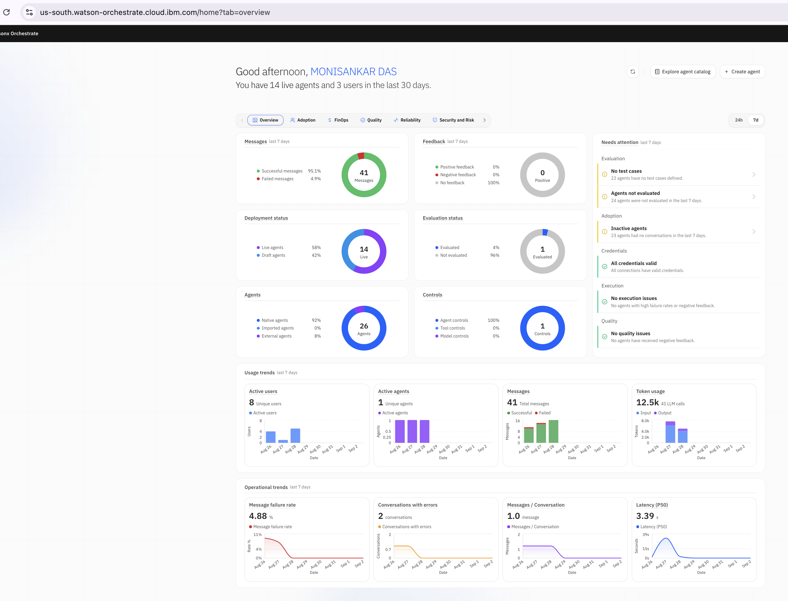
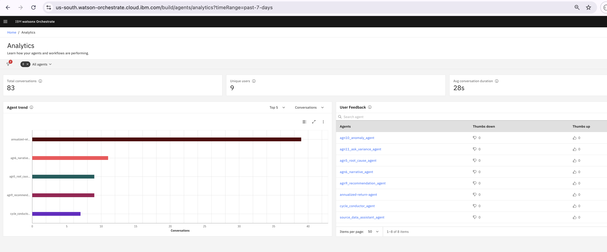
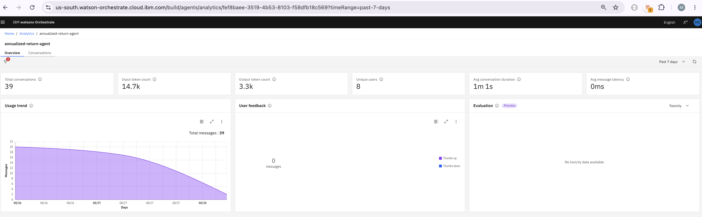
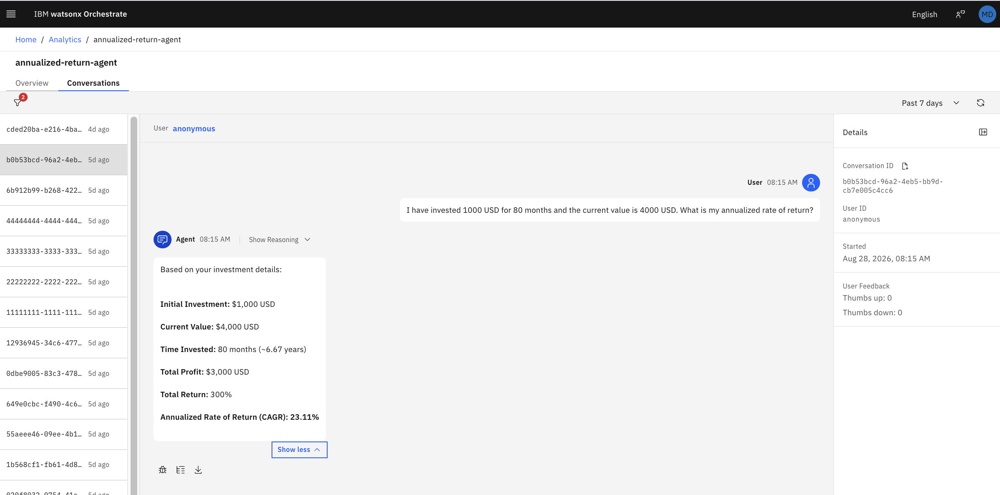
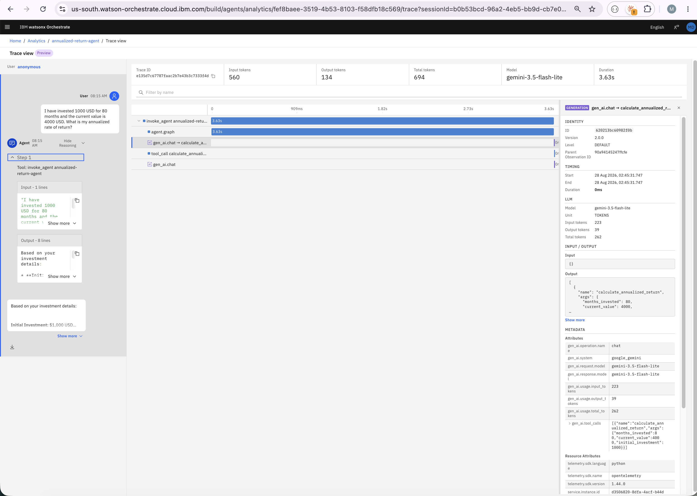

# Governing external agents with watsonx Orchestrate as an enterprise agentic control plane

*Register a LangGraph agent running on IBM Cloud Code Engine with watsonx Orchestrate over the Agent-to-Agent protocol, and export its traces with standard OpenTelemetry, without modifying the agent's code.*

**Monisankar Das, Senior Enterprise Architect, IBM Consulting**

---

## Introduction

Ask a simple question of any agent in your estate: *if it misbehaves at 2 a.m., who finds out, how, and what do they look at?* For agents built inside a managed platform the answer is a dashboard. For the agents that increasingly matter most, those built by product teams on LangGraph, CrewAI, or Google ADK and deployed on whichever cloud the team already uses, the answer is usually a pause, followed by "the logs".

That pause is the problem this article addresses. No one designs for it. Each team selects a reasonable framework, a reasonable model, and a reasonable runtime, and the aggregate is a fleet of agents that are individually well-engineered and collectively unaccountable: no shared inventory, no common way to route to them, no single view of cost or failure rate, and no place a CIO can go to answer "what is running, why, for whom, and is it doing its job?"

IBM watsonx Orchestrate (wxO) now positions itself as an **enterprise agentic control plane**: a governance and observability layer that applies to agents regardless of who built them, on which framework, and on which cloud. This article demonstrates that capability end to end with a reference implementation. A LangGraph agent is deployed *outside* wxO on IBM Cloud Code Engine behind an Agent-to-Agent (A2A) endpoint, discovered and registered in wxO, and instrumented with nothing more than the standard OpenTelemetry SDK, so that every conversation, LLM turn, and tool call appears in the wxO Analytics dashboard alongside natively built agents. The agent's own code (`agent.py`, `tools.py`) is left byte-for-byte unchanged.

Every code snippet in this article is taken from the companion repository, which contains the complete, deployable implementation.

---

## Why a control plane

The scale of the problem is well documented. OutSystems' *2026 State of AI Development* report, a survey of roughly 1,900 IT leaders published in April 2026, found that 96% of enterprises already use AI agents, 94% report that AI sprawl is increasing complexity, technical debt, and security risk, and only 12% have a centralized platform to manage it.

From an architecture standpoint, uncontrolled sprawl produces five compounding risks:

1. **Fragmentation.** HR, Finance, IT, and Sales each build agents in their own silo, on their own framework, while the business processes that matter cut across those silos.
2. **Governance and accountability gaps.** Autonomous systems run without enforceable runtime controls or an auditable trail of what they decided and why.
3. **Security and compliance exposure.** Agents reach into enterprise systems with permissions that no one reviews centrally.
4. **Operational blind spots.** Without cross-agent observability, incidents take longer to detect and diagnose, and failures cascade.
5. **Unclear ROI and cost escalation.** Token spend and business outcomes are scattered across dashboards that do not agree with one another.

A useful framing for platform teams: building an agent is roughly 20% of the work. The remaining 80% (integration, evaluation, deployment, monitoring, governance, security, optimization, and multi-agent coordination) is where projects stall. A control plane is the layer that owns that 80%.

---

## The agentic control plane in watsonx Orchestrate

wxO has long been a place to *build* agents: a no-code builder, an Agent Development Kit (ADK), tools, flows, and knowledge. The current release shifts the emphasis. The platform is organized around a governed **Agent Development Life Cycle (ADLC)** with two loops:

- a **build-time loop**: design, build, test, evaluate, and certify into a governed catalog; and
- a **runtime loop**: deploy, operate, monitor, observe, evaluate with real users, and optimize from data.

The runtime loop applies regardless of where an agent was built. Three open protocols serve as the on-ramps:

| What you have | How it connects to wxO |
|---|---|
| Agents deployed anywhere (LangGraph, CrewAI, ADK, Agentforce, Amazon Q, Copilot, custom) | **A2A** (Agent-to-Agent protocol), or an OpenAI-style chat completions endpoint |
| Tools running anywhere | **MCP** (Model Context Protocol) |
| Models hosted anywhere (watsonx, OpenAI, Anthropic, Bedrock, Gemini) | Standard model APIs through the **AI Gateway** |

Once an external agent is registered, native wxO orchestrator agents can use it as a **collaborator**, so routing, disambiguation, and planning pass through one governed entry point. Once it is instrumented, its execution traces (tools, models, latency, token counts, collaborators) are ingested into the same **Observe and Monitor** dashboards as native agents: a tenant-wide analytics overview, a per-agent dashboard with token, tool-usage, and feedback metrics, and a conversation history view with a full trace tree for every interaction.

The remainder of this article shows how to deliver that outcome for an agent wxO did not build.

---

## Reference architecture

```
┌─────────────────────────────────────────────────────────────────────────┐
│  IBM Cloud Code Engine  (us-south)   ← could equally be AWS / GCP / K8s │
│                                                                         │
│  ┌───────────────────────────────────────────────────────────────────┐  │
│  │  FastAPI A2A Server  (server.py)                                  │  │
│  │    GET  /.well-known/agent.json        AgentCard discovery        │  │
│  │    GET  /.well-known/agent-card.json   wxO ADK discover path      │  │
│  │    POST /  JSON-RPC 2.0                message/send · stream ·    │  │
│  │                                        tasks/get · tasks/cancel   │  │
│  │  ┌─────────────────────────────────────────────────────────────┐  │  │
│  │  │  LangGraph ReAct agent  (agent.py)  ·  Gemini 2.5 Flash     │  │  │
│  │  │  Tool: calculate_annualized_return  (tools.py)              │  │  │
│  │  └─────────────────────────────────────────────────────────────┘  │  │
│  │  ┌─────────────────────────────────────────────────────────────┐  │  │
│  │  │  OTel telemetry  (wxo_otel.py)                              │  │  │
│  │  │  ASGI middleware → IAM token exchange → OTLP/HTTP exporter  │  │  │
│  │  └─────────────────────────────────────────────────────────────┘  │  │
│  └───────────────────────────────────────────────────────────────────┘  │
└─────────────────────────────────────────────────────────────────────────┘
          ▲  A2A v0.3.0 / JSON-RPC 2.0          │  OTLP/HTTP traces
          │  (wxO calls the agent)              ▼  (agent pushes to wxO)
┌─────────────────────────────────────────────────────────────────────────┐
│  watsonx Orchestrate — Agentic Control Plane                            │
│  Registered external agent · Collaborator for native agents             │
│  Analytics → Overview · Agent dashboard · Conversations · Trace view    │
└─────────────────────────────────────────────────────────────────────────┘
```

Nothing in this stack is IBM-native except the control plane. The framework is LangGraph, the model is Google Gemini, the hosting is a generic container platform, and the wire protocols are open (A2A and OTLP). Substitute EKS for Code Engine and Claude on Bedrock for Gemini, and nothing in this article changes.

The agent itself is deliberately simple. It answers *"I invested $10,000 and it is now $13,500 after 18 months. What is my annualized return?"* by calling a single tool. The simplicity is intentional: the point of interest is everything that surrounds the agent, not the agent itself.

The integration has three parts, each described in its own section below:

1. **Expose** the agent over A2A so that it is discoverable and callable.
2. **Register** it in wxO to obtain an identity in the control plane.
3. **Instrument** it with OpenTelemetry so that its traces are ingested by the control plane.

---

## The agent remains unchanged

`agent.py` is a standard LangGraph ReAct loop: an `agent` node that calls Gemini with the tool bound, a `tools` node, and a conditional edge that loops until the model stops requesting tools.

```python
def create_react_agent():
    llm = ChatGoogleGenerativeAI(
        model=os.environ.get("GEMINI_MODEL", "gemini-2.5-flash"),
        temperature=0,
    )
    tools = [calculate_annualized_return]
    llm_with_tools = llm.bind_tools(tools)

    def agent_node(state: AgentState):
        return {"messages": [llm_with_tools.invoke(state["messages"])]}

    def should_continue(state: AgentState) -> Literal["tools", "end"]:
        last = state["messages"][-1]
        return "tools" if getattr(last, "tool_calls", None) else "end"

    workflow = StateGraph(AgentState)
    workflow.add_node("agent", agent_node)
    workflow.add_node("tools", ToolNode(tools))
    workflow.add_edge(START, "agent")
    workflow.add_conditional_edges("agent", should_continue, {"tools": "tools", "end": END})
    workflow.add_edge("tools", "agent")
    return workflow.compile(checkpointer=MemorySaver())
```

This is the architectural contract that makes the control-plane approach credible: **the framework team owns the agent; the platform team owns the wrapper.** Neither `agent.py` nor `tools.py` imports anything from OpenTelemetry or from wxO. When the data-science team ships a new version of the graph, registration and telemetry continue to work without modification.

---

## Exposing the agent over A2A

The Agent-to-Agent protocol turns "a Python function on a server" into "an agent that another agent can discover and call". wxO speaks A2A v0.3.0 natively. The agent is therefore wrapped in a small FastAPI server that implements the specification: an **AgentCard** for discovery, and a JSON-RPC 2.0 endpoint that supports `message/send`, `message/stream` (Server-Sent Events), `tasks/get`, and `tasks/cancel`.

The AgentCard is the agent's self-description and is what wxO reads during discovery:

```json
{
  "protocolVersion": "0.3.0",
  "name": "annualized-return-agent",
  "description": "A LangGraph-based AI agent that calculates the annualized rate of return for investments...",
  "url": "https://annualized-return-agent.<hash>.us-south.codeengine.appdomain.cloud",
  "capabilities": { "streaming": true, "pushNotifications": false, "stateTransitionHistory": true },
  "securitySchemes": { "bearerAuth": { "type": "bearer" } },
  "security": [ { "bearerAuth": [] } ],
  "skills": [
    {
      "id": "calculate-annualized-return",
      "name": "Calculate Annualized Rate of Return",
      "tags": ["finance", "investment", "returns"],
      "examples": [
        "I invested $10,000 and it's now worth $12,500 after 18 months. What's my annualized return?"
      ]
    }
  ]
}
```

Note one compatibility detail. The A2A specification serves the card at `/.well-known/agent.json`, whereas the wxO ADK `discover` command fetches `/.well-known/agent-card.json`. Register the same handler at both paths:

```python
@app.get("/.well-known/agent.json", response_model=AgentCard)
@app.get("/.well-known/agent-card.json", response_model=AgentCard)
async def agent_card():
    return _build_agent_card()
```

The `message/send` handler is a state machine over the A2A `Task` object (`submitted` → `working` → `completed` | `failed`). The agent's answer is returned both as an `Artifact` and as the status message. The line that matters for telemetry is the one that invokes the LangGraph graph. Because LangGraph's `invoke` is synchronous, it runs in a thread-pool executor, and the OpenTelemetry context must be captured *before* crossing the thread boundary. The reason is explained in the telemetry section.

```python
async def _run_agent(user_text: str, thread_id: str) -> str:
    agent = get_agent()
    config = {"configurable": {"thread_id": thread_id}}
    ctx = otel_context.get_current()           # capture on the async thread
    loop = asyncio.get_event_loop()
    response = await loop.run_in_executor(
        None,
        lambda: instrument_agent_invoke(
            agent, {"messages": [HumanMessage(content=user_text)]}, config, ctx
        ),
    )
    return format_response(response)
```

The server is packaged as a multi-stage `python:3.12-slim` image running as a non-root user and deployed to Code Engine with 1 vCPU / 4 GB, autoscaling from 1 to 5 replicas. The A2A endpoint is protected by a bearer token (`AGENT_API_KEY`) that the AgentCard advertises through `securitySchemes`.

---

## Registering the agent in the control plane

Registration is the point at which the agent stops being an island. wxO supports two methods.

**Auto-discovery** pulls the AgentCard and creates the registration in a single command:

```bash
orchestrate agents discover -u https://annualized-return-agent.<hash>.us-south.codeengine.appdomain.cloud
```

**YAML import** is the declarative, GitOps-friendly route. It is worth examining because it makes the governance surface explicit:

```yaml
spec_version: v1
kind: external
name: annualized_return_agent
title: Annualized Return Agent
provider: external_chat/A2A/0.3.0

api_url: "https://annualized-return-agent.<hash>.us-south.codeengine.appdomain.cloud"
auth_scheme: BEARER_TOKEN
auth_config:
  token: "<AGENT_API_KEY>"

chat_params:
  sendHistory: true      # forward the full conversation on every turn
  stream: false          # or true for SSE
  pushNotifications: false

config:
  hidden: false
  enable_cot: true       # surface chain-of-thought in the wxO chat

context_access_enabled: true
context_variables:
  - clientID
```

```bash
orchestrate agents import -f agent.yaml
```

Either method produces an **Agent ID**, a UUID minted by wxO. That ID is the linchpin of everything that follows: it is the identity the control plane uses to route to the agent, to expose it as a collaborator to orchestrator agents, and to attribute telemetry.

From this point, an end user conversing with a native wxO orchestrator agent can be routed to the LangGraph agent on Code Engine without any awareness of where it runs. Routing, disambiguation, and the AI Gateway's policy controls all apply.

---

## Exporting telemetry to the control plane

Registration provides routing and identity. Telemetry provides observability and, by extension, governance: what cannot be seen cannot be governed.

wxO supports two paths for an external agent to export traces. The integration guide summarizes them as follows:

| Aspect | Option 1: Generic OpenTelemetry export | Option 2: wxO Observability SDK |
|---|---|---|
| Dependency | Standard `opentelemetry-*` packages only | `ibm-watsonx-orchestrate-sdk` (pre-release at the time of writing) |
| Release status | Stable, generally available | Not yet officially released |
| Integration style | Build the tracer and exporter; create spans explicitly | Decorators: `trace_call`, `trace_tool_call`, `trace_llm_call`, `trace_agent_call` |
| Best fit | Non-LangGraph agents, or teams that want no wxO-specific dependency | LangGraph agents that want low-effort, typed spans |
| Auth handling | Application code exchanges the API key for a bearer token and sets OTLP headers | Handled by the SDK client |
| Result in wxO | Analytics overview and conversations | Identical |

This implementation uses **Option 1, generic OpenTelemetry export**, for architectural rather than technical reasons. OpenTelemetry is the lingua franca of enterprise observability. If an organization already ships traces to Instana, Datadog, Grafana Tempo, or a self-hosted Langfuse instance, the same `TracerProvider` can fan out to wxO *and* to those backends; wxO becomes one more OTLP destination rather than a competing agent. A zero-proprietary-dependency path is also the one that can be recommended to teams on other frameworks with no exposure to the wxO SDK.

### Required identifiers

Every export needs a small set of values from the control plane. The names used in this implementation are prefixed with `WXO_` so that a wxO credential can never collide with `GOOGLE_API_KEY` in the same process.

| Variable | What it is | Where it comes from |
|---|---|---|
| `WXO_AGENT_ID` | The registered agent's UUID | Printed by `orchestrate agents discover` / `import` |
| `WXO_TENANT_ID` | `<account-id>_<instance-id>` | wxO UI → Profile → About → CRN |
| `WXO_API_KEY` | IBM Cloud API key authorized for the instance | `ibmcloud iam api-key-create` (a dedicated key, not the deploy key) |
| `TOKEN_URL` | Token exchange endpoint | `https://iam.cloud.ibm.com/identity/token` for IBM Cloud SaaS |
| `OTEL_EXPORT_URL` | The trace ingestion endpoint | `https://api.<region>.watson-orchestrate.cloud.ibm.com/instances/<instance-id>/v1/orchestrate/inject/traces` |
| `ENVIRONMENT_NAME` | `draft` or `live` | Your choice; wxO filters analytics by it |
| `WXO_AGENT_NAME` | Short name used in the root span name (`invoke_agent <name>`) | Optional; set to `annualized_return_agent` here |

Because these are environment variables, enabling telemetry on an already-deployed agent is a configuration change rather than a rebuild:

```bash
ibmcloud ce app update --name annualized-return-agent \
  --env WXO_AGENT_ID="${WXO_AGENT_ID}" \
  --env WXO_TENANT_ID="${WXO_TENANT_ID}" \
  --env ENVIRONMENT_NAME="draft" \
  --env WXO_API_KEY="${WXO_API_KEY}" \
  --env OTEL_EXPORT_URL="${OTEL_EXPORT_URL}"
```

Treat `WXO_API_KEY` as a secret. Inject it from a secrets manager or a CI/CD variable, and never commit it to source control.

### Authentication for a long-running process

The reference script in the integration guide exchanges the API key for a bearer token once, at startup. That is adequate for a batch job. It is not adequate for a service that stays up for days, because IBM IAM tokens expire (typically after one hour) and the exporter would begin failing silently.

The solution is to wrap the standard `OTLPSpanExporter` in a small `SpanExporter` that lazily exchanges the key, reads the token's own `exp` claim to determine when it will expire, and transparently rebuilds the delegate exporter with a fresh token whenever the current one is within two minutes of expiry:

```python
class RefreshingOTLPSpanExporter(SpanExporter):
    """Refresh the bearer token and rebuild the OTLP/HTTP exporter as needed."""

    def _get_delegate(self) -> OTLPSpanExporter:
        with self._lock:
            if self._delegate is not None and time.time() < self._expires_at - 120:
                return self._delegate

            token, expires_at = _exchange_token()
            new_delegate = OTLPSpanExporter(
                endpoint=self._endpoint,
                headers={
                    "Authorization": f"Bearer {token}",
                    "x-ibm-tenant-id": self._tenant_id,
                    "x-ibm-agent-id": self._agent_id,
                    "x-langfuse-ingestion-version": "4",
                },
            )
            old_delegate, self._delegate, self._expires_at = self._delegate, new_delegate, expires_at
            if old_delegate is not None:
                old_delegate.shutdown()
            return new_delegate

    def export(self, spans):
        return self._get_delegate().export(spans)
```

The token exchange is a plain IAM call with two requirements that are easy to miss. IBM IAM expects `application/x-www-form-urlencoded` with `grant_type=urn:ibm:params:oauth:grant-type:apikey`, not a JSON body. And for IBM Cloud SaaS instances of wxO, the token URL is `iam.cloud.ibm.com`, not the MCSP endpoint shown in some older examples.

```python
def _exchange_token() -> tuple[str, float]:
    payload = urlencode({
        "grant_type": "urn:ibm:params:oauth:grant-type:apikey",
        "apikey": _required("WXO_API_KEY"),
    }).encode("utf-8")
    request = Request(_required("TOKEN_URL"), data=payload, method="POST",
                      headers={"Accept": "application/json",
                               "Content-Type": "application/x-www-form-urlencoded"})
    with urlopen(request, timeout=30) as response:
        body = json.loads(response.read().decode("utf-8"))
    token = body.get("token") or body.get("access_token")
    return token, _jwt_expiry(token) or time.time() + float(body.get("expires_in", 3000))
```

Note the three custom headers on the exporter. wxO's ingestion pipeline is Langfuse-backed, and `x-ibm-tenant-id` and `x-ibm-agent-id` are how the control plane attributes an incoming OTLP batch to the correct tenant and registered agent.

### Tracer provider and resource

`configure_wxo_telemetry()` builds a single global `TracerProvider` whose `Resource` carries the identity attributes, wires the refreshing exporter behind a `BatchSpanProcessor`, and registers `provider.shutdown` with `atexit` so that the final batch is flushed on process exit.

```python
resource_attributes = {
    "service.name": os.getenv("OTEL_SERVICE_NAME", "external-agent"),
    "service.version": os.getenv("OTEL_SERVICE_VERSION", "2.0.0"),
    "tenant.id": settings.tenant_id,
    "agent.id": settings.agent_id,
    "environment.name": settings.environment_name,
    "deployment.environment": settings.environment_name,
}
provider = TracerProvider(resource=Resource.create(resource_attributes))
provider.add_span_processor(BatchSpanProcessor(
    RefreshingOTLPSpanExporter(endpoint=_required("OTEL_EXPORT_URL"),
                               tenant_id=settings.tenant_id,
                               agent_id=settings.agent_id)))
trace.set_tracer_provider(provider)
atexit.register(provider.shutdown)
```

The integration guide suggests setting `OTEL_RESOURCE_ATTRIBUTES="tenant.id=${TENANT_ID},..."` in the shell. Code Engine does not expand `${VAR}` references inside environment variable values, so build the resource dictionary from resolved variables at runtime instead.

### One root span per conversation turn

Rather than scattering spans through request handlers, wrap the entire A2A request in an **ASGI middleware** registered last in FastAPI (and therefore outermost). The middleware opens one `SERVER`-kind root span named `invoke_agent <agent_name>` around every HTTP request, which is exactly what wxO renders as one row in the Conversations view.

```python
app.add_middleware(WxoA2ATraceMiddleware)   # outermost: wraps CORS and all business logic
```

The middleware must solve an ASGI-specific problem. The request body can be read only once, yet the middleware needs the JSON-RPC payload (to extract `contextId` for the thread and the user's text for the `input` attribute) and FastAPI downstream still needs to read it. The middleware therefore drains `receive()` into a buffer, hands the application a `replay_receive()` closure, and similarly wraps `send()` to capture the response body so that `output` and the status attributes can be set after the application has finished streaming.

```python
span_name = f"invoke_agent {self.settings.agent_name}"
with self.tracer.start_as_current_span(span_name, kind=SpanKind.SERVER) as span:
    span.set_attribute("agent.id", self.settings.agent_id)
    span.set_attribute("environment.name", self.settings.environment_name)
    span.set_attribute("message.id", context["message_id"])
    span.set_attribute("langfuse.user.id", context["user_id"])
    if context["thread_id"]:
        span.set_attribute("thread.id", context["thread_id"])
        span.set_attribute("langfuse.session.id", context["thread_id"])
        span.set_attribute("conversation.id", context["thread_id"])
    if self.settings.capture_content:
        span.set_attribute("input", context["input"])
    try:
        await self.app(scope, replay_receive, capture_send)
    finally:
        response_payload = _decode_json(bytes(response_body))
        span.set_attribute("http.response.status_code", status_code)
        output = _response_text(response_payload)
        if self.settings.capture_content and output:
            span.set_attribute("output", output)
        failure = _technical_failure(response_payload, status_code)
        if failure:
            span.set_attribute("agent.execution.status", "error")
            span.set_status(Status(StatusCode.ERROR, failure[1][:1000]))
        else:
            span.set_attribute("agent.execution.status", "success")
            span.set_attribute("agent.business_outcome",
                               "failed" if _find_business_failure(response_payload) else "success")
```

Three design points deserve attention:

- **Session correlation.** The A2A `contextId` is mapped to `thread.id`, `langfuse.session.id`, and `conversation.id`, so a multi-turn conversation that wxO routes to this agent appears as one session in the dashboard rather than as unrelated requests.
- **Technical versus business failure.** An HTTP 500 or a JSON-RPC error is a *technical* failure. A tool that returns `{"success": false, ...}` with HTTP 200 is a *business* failure. Both are surfaced as span attributes (`agent.execution.status`, `agent.business_outcome`, `agent.business_error.code`). This is the distinction an operations team needs when deciding whether to page an SRE or a product owner.
- **Content capture is a switch.** `WXO_CAPTURE_CONTENT=false` removes the `input` and `output` attributes entirely. For regulated workloads where prompts may contain PII, this retains timing, token, and outcome telemetry while keeping payloads out of the control plane.

### Child spans across the thread boundary

The root span covers the HTTP request. To show what the agent *did*, emit child spans for the graph run, each LLM turn, and each tool call. The complication is that LangGraph's `invoke` runs in a thread-pool executor, and OpenTelemetry context is thread-local: spans opened on the executor thread would start new, orphaned traces. `instrument_agent_invoke` therefore re-attaches the context captured on the async side before doing anything else.

```python
def instrument_agent_invoke(agent, inputs, config, ctx):
    tracer = trace.get_tracer("wxo-server", "2.0.0")
    token = otel_context.attach(ctx)          # restore the async thread's context here
    try:
        with tracer.start_as_current_span("agent.graph", kind=SpanKind.INTERNAL) as graph_span:
            try:
                response = agent.invoke(inputs, config)
            except Exception as exc:
                graph_span.record_exception(exc)
                graph_span.set_status(Status(StatusCode.ERROR, str(exc)))
                raise
            messages = response.get("messages", [])
        _emit_message_spans(tracer, ctx, messages)
    finally:
        otel_context.detach(token)
    return response
```

`_emit_message_spans` walks the final LangGraph message list. Each `AIMessage` becomes a `gen_ai.chat` span carrying the GenAI semantic-convention attributes that wxO uses for its model and token summaries (`gen_ai.system`, `gen_ai.request.model`, `gen_ai.usage.input_tokens`, `gen_ai.usage.output_tokens`, `gen_ai.usage.total_tokens`, and the tool-call intent as `gen_ai.tool_calls`). Each `ToolMessage` becomes a `tool_call <name>` span with `tool.name`, `tool.output`, and a `tool.business_outcome` derived by scanning the tool's JSON for `success: false`.

```python
with tracer.start_as_current_span(span_name, kind=SpanKind.CLIENT, start_time=span_start_ns) as span:
    span.set_attribute("gen_ai.operation.name", "chat")
    span.set_attribute("gen_ai.system", "google_gemini")
    span.set_attribute("gen_ai.request.model", model_name)
    span.set_attribute("gen_ai.response.model", model_name)
    usage = getattr(msg, "usage_metadata", None) or {}
    if usage:
        span.set_attribute("gen_ai.usage.input_tokens", int(usage.get("input_tokens", 0)))
        span.set_attribute("gen_ai.usage.output_tokens", int(usage.get("output_tokens", 0)))
        span.set_attribute("gen_ai.usage.total_tokens", int(usage.get("total_tokens", 0)))
```

This is post-hoc instrumentation: the spans are created after the graph has finished, from the messages it returned. The trade-off is deliberate. It keeps the agent code untouched and works for any LangGraph graph, at the cost of synthetic timestamps for the child spans (each is offset by one millisecond so that wxO renders them in execution order). Where per-step latency matters, LangGraph callback handlers or the wxO SDK decorators (Option 2) provide real timings; the outer spans and token counts here are exact in either case.

---

## Verifying the result in the control plane

Send a request through wxO (or directly to the A2A endpoint). The Code Engine log records:

```
wxO trace queued trace_id=<32-hex> thread_id=<uuid> status=success
```

Within a few seconds, under **Analyze → Annualized Return Agent → Conversations**, the trace appears with the following tree:

```
invoke_agent annualized_return_agent            ← root (SERVER), one per A2A request
  ├─ agent.graph                                ← the whole LangGraph invoke
  ├─ gen_ai.chat → calculate_annualized_return  ← LLM turn that decided to call the tool
  ├─ tool_call calculate_annualized_return      ← the tool, with its JSON output
  └─ gen_ai.chat                                ← LLM turn that wrote the final answer
```

The following screens show the external agent as it appears in the control plane.

  
*Figure 1: The wxO control plane landing page.*  

  
*Figure 2: The tenant-wide analytics dashboard. The LangGraph agent running on Code Engine appears alongside native wxO agents.*  

  
*Figure 3: The per-agent dashboard for the external agent.*   

  
*Figure 4: A single conversation with the external agent.*   

  
*Figure 5: The detailed trace for that conversation, showing the root span and its LLM and tool-call children.*    

The captured trace, retrievable through wxO's trace API, shows what the control plane now knows about an agent it did not build: the user's input, the agent's output, the session ID, the model, 560 input tokens and 134 output tokens for the turn, the environment, and the agent and tenant identity, all queryable and exportable.

From this point the standard wxO runtime-loop capabilities apply to the agent like any other: usage and duration trends, token consumption, tool-call success rates, user feedback (CSAT), and the out-of-the-box evaluation metrics for task success, reliability, and safety that are being rolled out in public preview.

---

## Implementation notes and pitfalls

The following constraints were established empirically during the implementation and will save considerable debugging time.

**Do not send `agent.name` alongside `agent.id`.** Setting both, at resource or span level, causes the ingestion pipeline to classify the trace as an "agent" observation, which wraps the root span's `output` into a chat-message array even when a plain string was sent; the Trace View then renders `[object Object]`. `agent.id` alone is sufficient for attribution.

**Do not set `gen_ai.input.messages` or `gen_ai.output.messages` on any span.** wxO derives the conversation's chat output from those structured attributes wherever they appear, and the derived value collides with the root span's scalar `output`. All other `gen_ai.*` attributes (operation name, system, model, usage) are safe and are what populate the model and token summary panels.

**Use plain `input` and `output` on the root span,** not `gen_ai.input.value` and its relatives. Scalars pass through untouched, which is what the Trace View chat bubble expects.

**Flush.** `BatchSpanProcessor` exports asynchronously. For a long-running server, register `shutdown()` with `atexit`; for a script, call `force_flush()` before exit or the final batch will be lost.

**Registration is currently a prerequisite.** Today, an external agent must be registered (through the UI, `discover`, or YAML import) to obtain the Agent ID that telemetry requires. IBM has indicated that a dedicated Agent Registry will issue IDs for external agents directly in a future release. The code in this article will not change; only the provisioning step becomes simpler.

---

## What the pattern delivers

Strip away the code and consider the outcome. An agent built by a LangGraph team, on a non-IBM model, on a generic container platform, is now:

1. **Discoverable and identifiable.** It has an identity in the enterprise catalog rather than a URL in a wiki.
2. **Routable through a governed front door.** Native orchestrator agents can delegate to it, and the AI Gateway's policy controls apply on the way in.
3. **Observable at three altitudes.** Tenant-wide (conversation volume, agent usage, sentiment), per-agent (tokens, tool usage, feedback, duration), and per-conversation (the full span tree with inputs, outputs, and outcomes).
4. **Governable.** Because the traces carry business outcomes, error taxonomies, session identity, and environment labels, they can drive alerts, evaluations, audits, and cost attribution from a single place.
5. **Portable.** Everything it emits is standard OpenTelemetry. If the enterprise observability strategy changes, the instrumentation does not.

All of this is achieved with roughly one Python file of platform-owned plumbing and zero changes to the agent. That separation of concerns (framework teams own agents, the platform team owns the wrapper, the control plane owns governance) is the operating model to adopt for any organization scaling beyond its first handful of agents.

The case for an agentic control plane can sound abstract until a Gemini-backed LangGraph agent on Code Engine appears in the same dashboard as a native wxO agent, with the same token counts, the same session view, and the same trace tree. At that point the "build here or govern here" debate dissolves: build where teams are productive, and govern in one place.

---

## Resources

The companion repository contains everything shown in this article: the LangGraph agent, the A2A server with Pydantic models for the v0.3.0 specification, the `wxo_otel.py` telemetry module, a multi-stage Dockerfile, a one-shot Code Engine deployment script, the `agent.yaml` registration spec, and captured trace JSON for comparison. The README covers local development, deployment, registration, and enabling telemetry step by step, together with a troubleshooting table for the errors most likely to be encountered.

*[Repository link placeholder]*

For platform and architecture leads addressing agent sprawl, a practical next step is to select one external agent the organization already runs and apply this pattern to it. The conversation with leadership changes the moment "what is running, why, for whom, and how is it performing" can be answered from a single screen.

---

*Monisankar Das is a Senior Enterprise Architect at IBM Consulting, working on agentic AI systems, multi-agent orchestration, and enterprise observability. Opinions are his own.*
