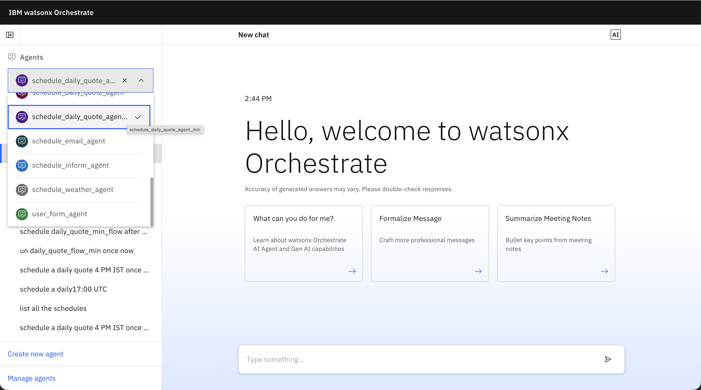
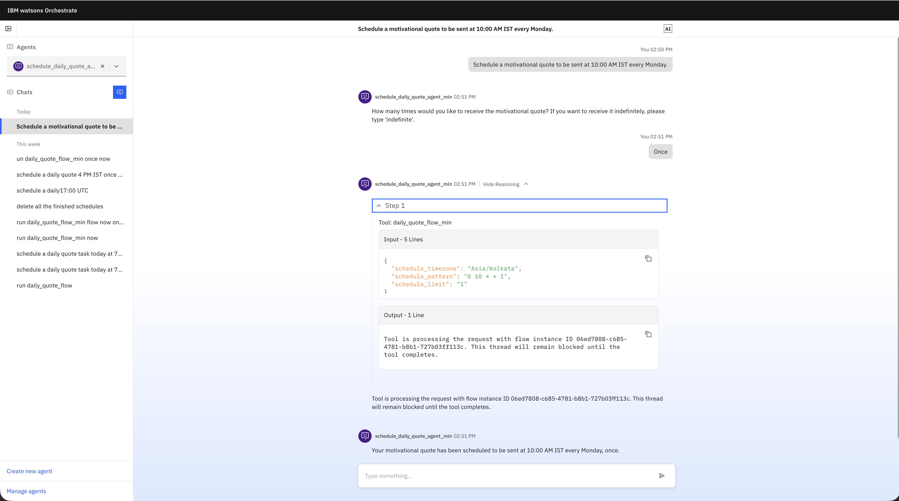
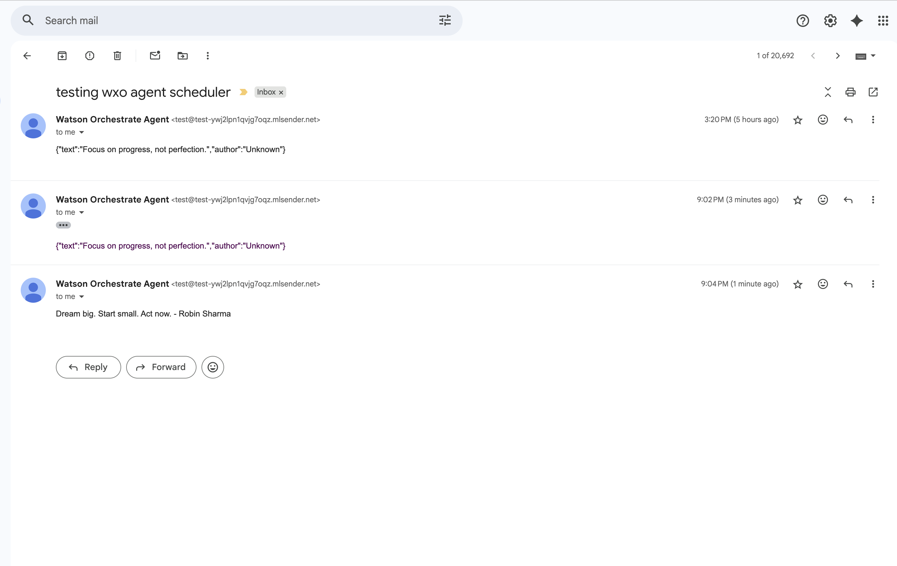

# 🌅 Daily Quote Scheduler — Watsonx Orchestrate (WXO) ADK

**Automate your daily inspiration with AI agents, custom tools, and MailerSend**

This repository demonstrates how to build a *Daily Quote Scheduler* using the Watsonx Orchestrate ADK. It contains:
- a MailerSend **email tool** (`send_email_tool.py`)  
- a **quote generator** tool (`get_quote_min.py`)  
- a **schedulable flow** that fetches a quote and delegates delivery to an agent (`daily_quote_flow_min.py`)  
- two agent manifests (`agent_email_test.yaml`, `schedule_daily_quote_agent_min.yaml`)  
- instructions for importing, testing, and scheduling in Watsonx Orchestrate (CLI + UI)

---

## Overview
This example demonstrates two integration patterns:

1. **Tool-based**: tools are deterministic actions (send email, fetch quote).  
2. **AgentNode delegation**: the flow can hand off to an agent (LLM-capable) that can personalize content, run governance checks, or choose delivery channels.

A succinct explanation of the core flow:

> `daily_quote_flow_min` is a schedulable flow that calls the `get_quote_min` tool to fetch a `Quote` and then delegates delivery via an `AgentNode` (`notify_user_via_agent`) to the `email_test_agent`. Setting `schedulable=True` exposes the flow in the Orchestrate UI scheduler so users can create time-based triggers (one-off or recurring).

---

## Prerequisites
- Watsonx Orchestrate ADK & CLI installed and configured for your workspace.  
- Access to a Watsonx Orchestrate instance (SaaS or on-prem).  
- Python 3.10+ (3.11 recommended).  
- `requests`, `pydantic` Python packages.  
- MailerSend account (domain verified) and an API token.

---


## MailerSend: token & domain setup

1. Sign in: `https://app.mailersend.com/`.  
2. Create token: **Integrations → MailerSend API → Manage → Create new token**  
   - Name: `wxo-daily-quote-scheduler`  
   - Scope: `Sending` (least privilege recommended)  
   - **Copy the token now** — MailerSend displays it only once.  
3. Go to `https://app.mailersend.com/domains/`: get the test domain name.

---

## Environment variables
Set the MailerSend secrets (local testing):

```bash
export MAILERSEND_API_KEY="mlsn_xxx_your_token_here"
export MAILERSEND_FROM_EMAIL="no-reply@example.com"
```
---

## Import tools, flows, and agents

Use the `orchestrate` CLI (example commands):

Instead of running multiple commands manually, you can use the provided **import script** to import everything in one go.

```bash
# Run the import script
./import_all.sh
```

After import, verify via UI: **Agents** should list `email_test_agent` and `schedule_daily_quote_agent_min`. **Flows** should show `daily_quote_flow_min`.

---

## Schedule the flow (WXO UI)






---

