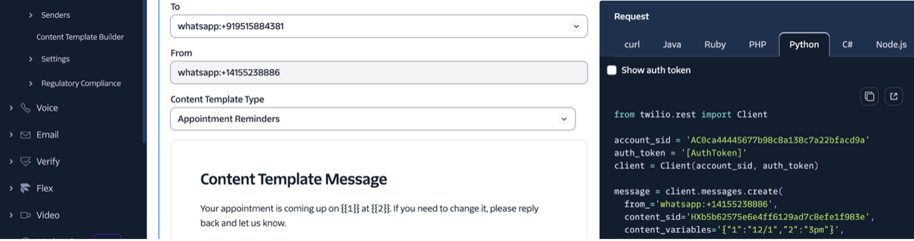
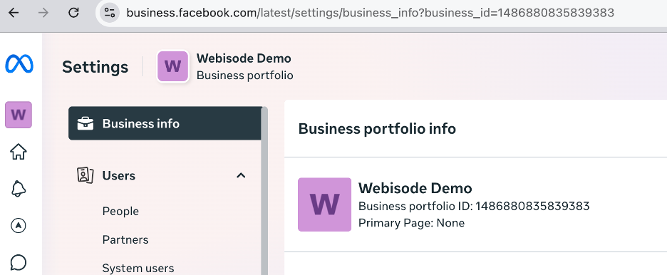

# i-oic-wxo-multichannel-integration

## Omnichannel AI Agents: Integrating Conversations Across WhatsApp, Slack, and Facebook

This tutorial demonstrates how AI agents built and deployed on IBM watsonx Orchestrate can be accessed via multiple channels like WhatsApp , Facebook and Facebook.

The reference project is organized into three main sections, each outlining specific configuration details.
Every section includes its own `README.md` file with step-by-step instructions for setting up the prerequisites required for each integration.

- **WhatsApp Integration**
- **Facebook Integration**
- **Slack Integration**

## Overview
This repository hosts **Agentic AI tutorials** developed as part of the Open Innovation Community initiative. These tutorials provide step-by-step guidance for building and integrating AI agents.

## Contact
For questions or support, please contact [the contributors](https://github.com/IBM/oic-i-agentic-ai-tutorials/graphs/contributors).

## Step 1: Create and Set Up a Twilio Account
1.	Go to the Twilio website and sign up for an account.
2.	In the Develop section, navigate to Phone Numbers and follow the prompts to get a new number.
3.	Make sure the number supports voice, SMS, and MMS capabilities.
4.	If possible, register multiple numbers at once to reduce setup time. (Note: if a number was previously linked to another business, WhatsApp might not approve it.)
5.	Keep your Twilio Dashboard open during this process for quick access to configuration details.

 
6.	Once your number is set up, click your account name in the top-left corner of the Twilio Dashboard to open the Account Settings page. 
7.	Copy your Account SID and Auth Token you’ll need these credentials later when connecting your WhatsApp channel to your agent.

Step 2: Set Up Your Meta Business Account
1.	Visit the Meta Business Tools page and select Create new account.
 Follow the guided steps to set up your business profile.
2.	Once your account is created, go to Settings → Business Info.
 At the top of the page, you’ll find your Meta Business Manager ID - copy this for later use.

Step 3: Enable Twilio Numbers for WhatsApp

To connect your Twilio numbers with WhatsApp, you must use Meta’s WhatsApp Tech Provider Program, which is the official onboarding process for all WhatsApp integrations starting year 2025.
