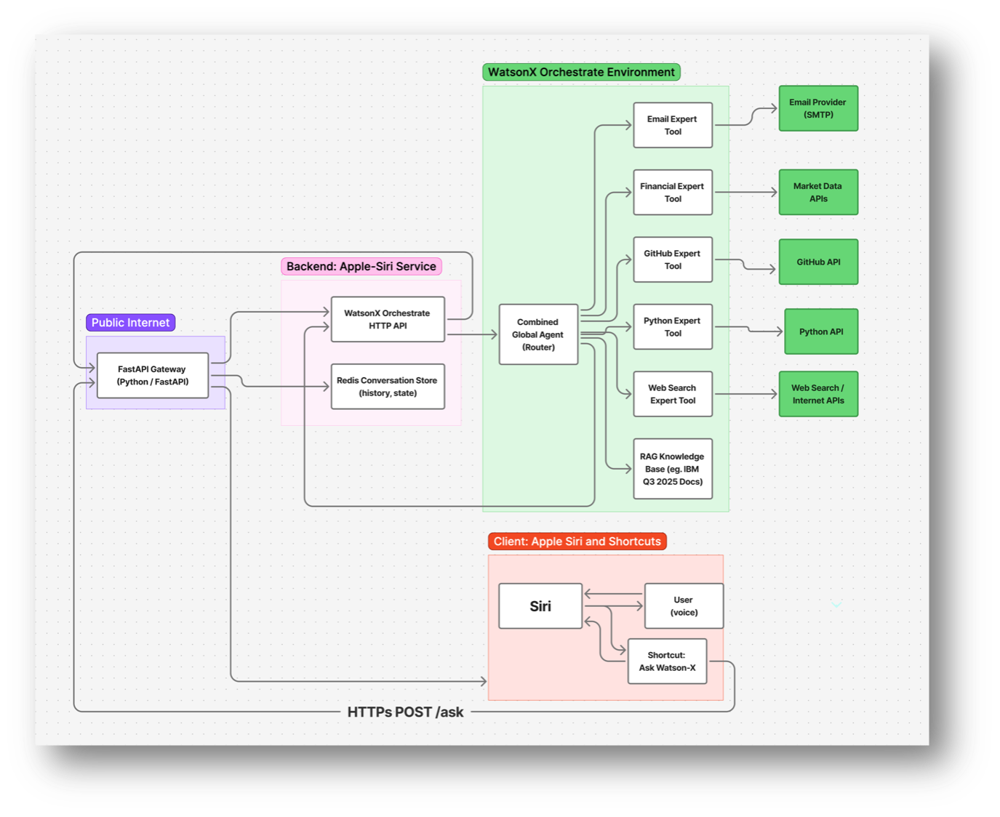
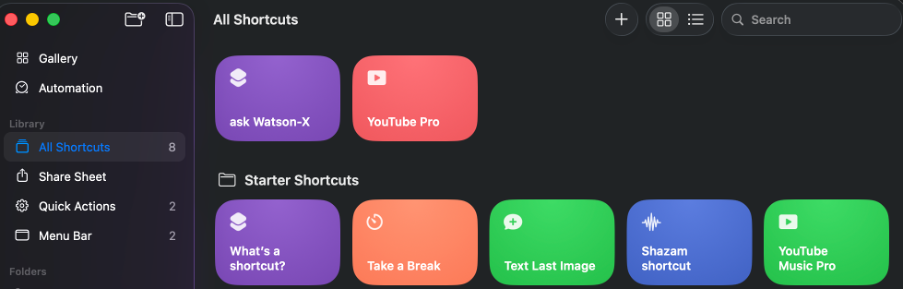
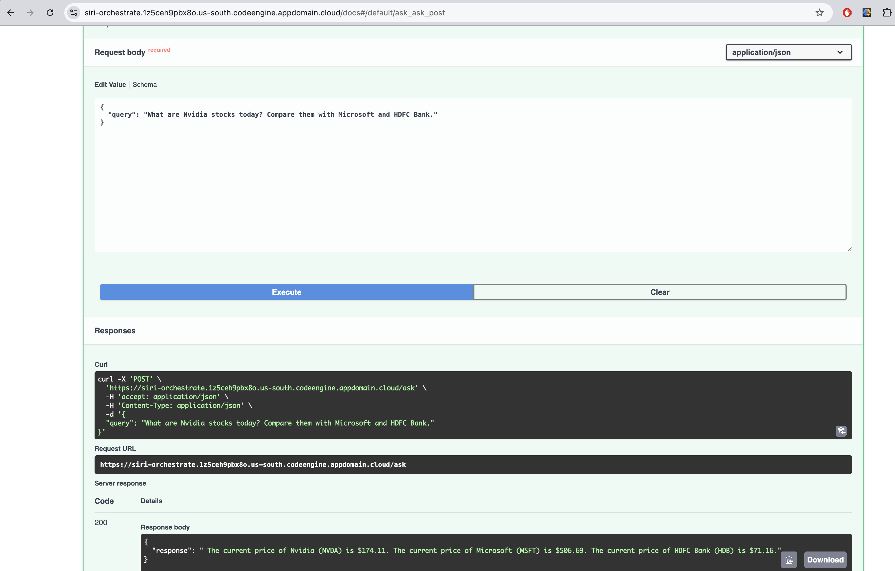
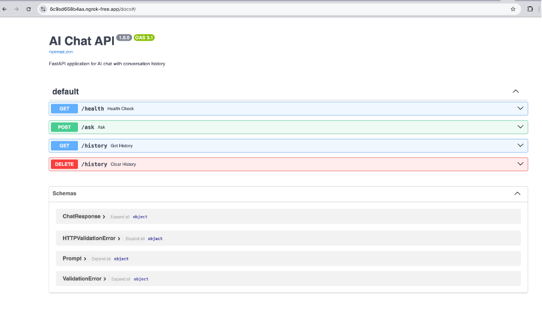
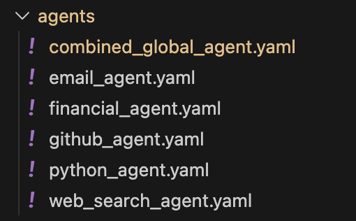
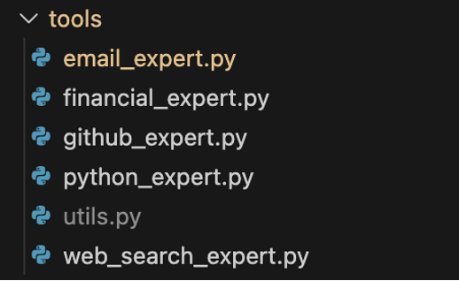
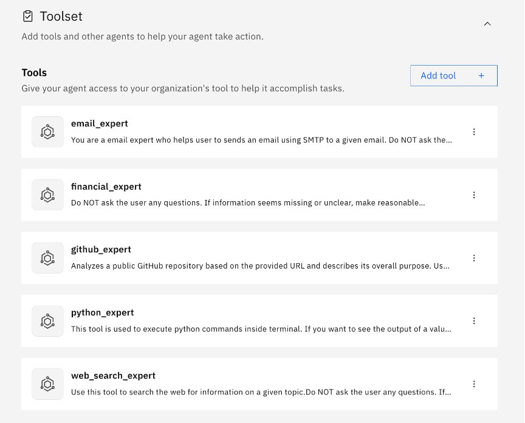
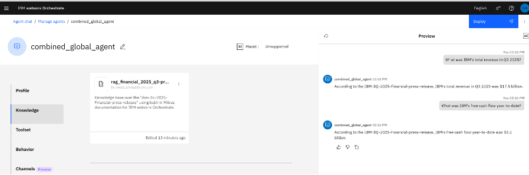
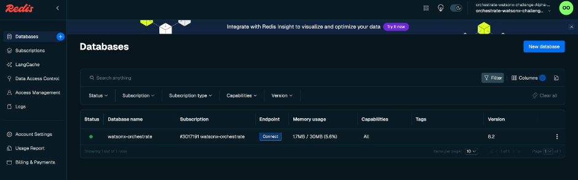

# 🚀 WatsonX Orchestrate + Apple Siri

### **Voice-Activated Multi-Domain AI Assistant**

<video src="docs/3.WatsonX Orchestrate Apple Siri Demo.mp4" controls muted loop width="600"></video>

👉 **Shortcut Link:** [https://www.icloud.com/shortcuts/52ca2e186af34a979283791c8fc718aa](https://www.icloud.com/shortcuts/52ca2e186af34a979283791c8fc718aa)
👉 **Demo Video:** `/docs/3.WatsonX Orchestrate Apple Siri Demo.mp4`

---

# 📌 Overview

This project integrates **Apple Siri**, **IBM WatsonX Orchestrate (ADK)**, and **watsonx.ai models** to build a **voice-first AI assistant** capable of:

* RAG document Q&A
* Email automation
* Real-time finance queries
* GitHub repository analysis
* Python code execution
* Web search
* Full conversation memory
* Multi-step reasoning workflows

It’s designed for IBM developers, consultants, and enterprise users who work across documents, code, financials, communication, and research — all hands-free using Siri.

---

# 🧠 Why This Matters

Consultants and engineers constantly multitask — across meetings, screens, documents, email, and research.

Common problems:

* Assistants lose context
* No multimodal support
* No hands-free workflows
* Can’t operate across **documents + APIs + GitHub + email + finance**
* Can't chain multi-step actions

This integration gives Siri a **watsonx-powered cognitive layer**, solving all of these problems.

---

# 🏗️ Architecture (Full System)

[](docs/Architecture_diagram.png)

---

# 🔧 Components

## 1️⃣ Apple Siri + Shortcuts

This shortcut:

* Listens to your voice
* Sends your text to FastAPI
* Speaks back WatsonX’s response
* Enables a fully hands-free workflow

[](docs/Shortcuts.png)

Shortcut structure (dictate → POST to backend → speak response):


---

## 2️⃣ Backend — FastAPI Gateway

This server is the bridge between Siri and WatsonX.

### Key Features

* Redis conversation memory
* Token handling + caching
* Async LLM requests
* Clean error handling
* Health/status endpoints

[](docs/fastapi.png)

### API Endpoints

[](docs/fastapi_endpoints.png)

---

## 3️⃣ Multi-Domain Orchestrate Agent (Router)

The `combined_global_agent.yaml` routes user queries to the correct expert tool.

[](docs/agents.png)

---

## 4️⃣ Expert Tools (6 total)

Tools are written in Python.

[](docs/tools.png)

### Included Tools:

* **email_expert** → Send emails via SMTP
* **financial_expert** → Stock/market queries
* **github_expert** → Repo analysis
* **python_expert** → Safe code execution
* **web_search_expert** → DuckDuckGo search
* **RAG Expert** → Document retrieval from knowledge base

[](docs/experts.png)

---

## 5️⃣ Knowledge Base (RAG)

Custom documents are uploaded to Orchestrate.

[](docs/knowledbases.png)

---

## 6️⃣ Redis Conversation Memory

You store session memory using Redis Cloud.

[](docs/redis.png)

---

# ⚙️ How the System Works End-to-End

## **1. You speak to Siri**

**“Hey Siri, ask WatsonX: what’s IBM’s Q3 revenue?”**

## **2. Apple Shortcut**

* Captures voice
* Sends JSON → FastAPI
* Waits for response
* Speaks back the answer

## **3. FastAPI**

* Restores conversation memory from Redis
* Passes enriched context to Orchestrate
* Routes through correct expert tool
* Stores updated memory

## **4. Orchestrate Agent**

* Routes to RAG / Finance / GitHub / Email / Python / Web Search experts
* LLM processes result

## **5. Siri speaks result to user** 🎤

---

# 🧪 Real-World Examples

### **📄 RAG Research**

“Summarize key insights from the IBM Q3 report.”

### **🧮 GitHub + Python**

“Analyze the repo and compute cyclomatic complexity.”

### **📈 Finance**

“What are Nvidia, Microsoft, and HDFC stock prices?”

(Sample from your API UI:)


---

# 📦 Setup Guide

## 1️⃣ Clone Repo

```
git clone https://github.ibm.com/Owais-Ahmad/siri-watsonx-orchestrate
cd siri-watsonx-orchestrate
```

---

## 2️⃣ Install dependencies

```
pip install -r requirements.txt
```

---

## 3️⃣ Configure `.env`

Copy and edit:

```
cp .env.example .env
```

Fill:

* IAM API key
* Redis URL
* SMTP creds
* GitHub token
* WatsonX project + space IDs

---

## 4️⃣ Start FastAPI server

```
python main.py
```

---

## 5️⃣ Add Knowledge Base

Upload PDFs or docs to Orchestrate:


---

## 6️⃣ Configure Tools in Orchestrate

Upload your tool definitions.


---

## 7️⃣ Install Siri Shortcut

Open the iCloud link → set your server URL → done.


---

# 🌐 API Demo (Swagger)


---

# 🚀 Deployment

Supports:

* IBM Code Engine
* Docker
* Kubernetes
* Ngrok for local testing
* Redis Cloud

---

# 🗺 Roadmap

* Multi-language voice
* Calendar + meeting automation
* More financial sources
* Multi-user profiles
* Optimized vector RAG indexing
* Microservice tool split

---

# 🙌 Acknowledgements

This project is part of the **IBM Open Innovation Community – Agentic AI**.